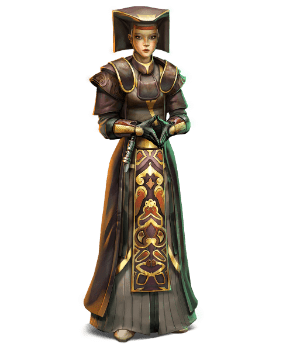

- [Console](#console)
  - [Privilegi di Classe](#privilegi-di-classe)
    - [**Punti Ferita**](#punti-ferita)
    - [**Competenze**](#competenze)
    - [**Equipaggiamento**](#equipaggiamento)
    - [Forza-lancio](#forza-lancio)
    - [Poteri della Forza Conosciuti](#poteri-della-forza-conosciuti)
    - [Punti Forza](#punti-forza)
    - [Livello Massimo del Potere](#livello-massimo-del-potere)
    - [Caratteristica da forza-lancio](#caratteristica-da-forza-lancio)
    - [Recupero della Forza](#recupero-della-forza)
    - [Forza-lancio Potenziato](#forza-lancio-potenziato)
    - [Scudo della Forza](#scudo-della-forza)
    - [Affinita' alla Forza](#affinita-alla-forza)
    - [Tradizione Consolare](#tradizione-consolare)
    - [Aumento dei Punteggi Caratteristica](#aumento-dei-punteggi-caratteristica)
    - [Tutt'uno con la Forza](#tuttuno-con-la-forza)

 
 

# Console

|Livello|Bonus Competenza|Privilegi|Poteri della Forza Conosciuti|Punti Forza|Livello Massimo del Potere|Opzioni di Forza-lancio Potenziato
|---|---|---|---|---|---|---
|1|+2|[Forza-lancio](#forza-lancio), [Recupero della Forza](#recupero-della-forza)|9|4|1|-
|2|+2|[Forza-lancio potenziato](#forza-lancio-potenziato), [Scudo della Forza](#scudo-della-forza)|11|8|1|2
|3|+2|[Affinita' alla Forza](#affinita-alla-forza), [Tradizione Consolare](#tradizione-consolare)|13|12|2|2
|4|+2|[Aumento dei Punteggi Caratteristica](#aumento-dei-punteggi-caratteristica)|15|16|2|2
|5|+3|-|17|20|3|2
|6|+3|[Tratto Consolare](#tradizione-consolare)|19|24|3|2
|7|+3|-|21|28|4|2
|8|+3|[Aumento dei Punteggi Caratteristica](#aumento-dei-punteggi-caratteristica)|23|32|4|2
|9|+4|-|25|36|5|3
|10|+4|[Tratto Consolare](#tradizione-consolare)|26|40|5|3
|11|+4|-|28|44|6|3
|12|+4|[Aumento dei Punteggi Caratteristica](#aumento-dei-punteggi-caratteristica)|29|48|6|3
|13|+5|-|31|52|7|3
|14|+5|[Tratto Consolare](#tradizione-consolare)|32|56|7|3
|15|+5|-|34|60|8|3
|16|+5|[Aumento dei Punteggi Caratteristica](#aumento-dei-punteggi-caratteristica)|35|64|8|3
|17|+6|-|37|68|9|4
|18|+6|[Tratto Consolare](#tradizione-consolare)|38|72|9|4
|19|+6|[Aumento dei Punteggi Caratteristica](#aumento-dei-punteggi-caratteristica)|39|76|9|4
|20|+6|[Tutt'uno con la Forza](#tuttuno-con-la-forza)|40|80|9|4

## Privilegi di Classe

---

### **Punti Ferita**

**Dadi Vita:** 1d6 per livello

**Punti Ferita al livello 1:** 6 + modificatore di Costituzione

**Punti Ferita ai Livelli Successivi:** 1d6 (o 4) + modificatore di Costituzione

---

### **Competenze**

**Armature:** nessuna

**Armi:** armi-laser semplici, vibro-armi semplici

**Strumenti:** nessuno

**Tiri Salvezza:** Saggezza, Carisma

**Abilita':** 2 tra: Inganno, Intuizione, Intimidire, Indagare, Storia, Medicina, Persuasione

---

### **Equipaggiamento**

- (a) 1 arma-laser semplice | (b) 1 vibro-arma semplice
- (a) 1 dotazione da studioso | (b) 1 dotazione da esploratore | (c) 1 dotazione da diplomatico

**Variante: ricchezza iniziale**

Puoi decidere di non ricevere equipaggiamento dalla tua classe e dal tuo background e di scegliere la ricchezza iniziale in questo modo:

|Classe|Fondi
|---|---
|Console|5d4 x 100 cr

---

### Forza-lancio
Vedi questa sezione per i dettagli sul forza-lancio e questa sezione per la lista dei poteri della forza.

### Poteri della Forza Conosciuti
Impari 9 poteri della forza a scelta e ne impari altri ai livelli superiori (vedi la tabella). Non puoi imparare un potere di livello superiore a quello indicato nella colonna Livello Massimo del Potere e puoi imparare un potere contestualmente a quando acquisisci uno dei suoi prerequisiti.

### Punti Forza
Possiedi un numero di punti forza pari al tuo livello da console x 4 (come indicato nella tabella) + il tuo modificatore di Carisma o Saggezza (scegli tu). Utilizzi questi punti forza per lanciare i poteri della forza. Recuperi tutti i punti forza spesi quando completi un riposo lungo.

### Livello Massimo del Potere
Alcuni poteri della forza possono essere lanciati a livelli superiori utilizzando il numero indicato di punti forza aggiuntivi. Puoi aumentare il livello di un potere fino al numero indicato nella colonna Livello Massimo del Potere della tabella. 

Puoi lanciare dei poteri di livello 6, 7, 8 e 9 solamente una volta ogni riposo lungo.

### Caratteristica da forza-lancio
Utilizzi Saggezza per i poteri del lato chiaro della forza, Carisma per i poteri del lato oscuro della forza e Carisma o Saggezza per i poteri universali (scegli tu). Utilizzi questa abilita' ogni volta che un potere fa riferimento alla caratteristica da forza-lancio. Inoltre utilizzi questo modificatore quando devi determinare la CD dei tiri salvezza dei poteri della forza che lanci e quando effettui un attacco con un potere della forza.

**CD del tiro salvezza della forza:** 8 + bonus di competenza + il tuo modificatore di forza-lancio

**Modificatore di attacco della forza:** bonus di competenza + il tuo modificatore di forza-lancio

### Recupero della Forza
Quando completi un riposo breve puoi scegliere di recuperare un numero di punti forza pari a meta' del tuo livello da console + il modificatore di Saggezza o Carisma (scegli tu, minimo 1).

Puoi riutilizzare questo privilegio dopo aver completato un riposo lungo

### Forza-lancio Potenziato
Quando lanci un potere della forza puoi spendere punti forza addizionali per modificarlo. Ottieni 2 opzioni di forza-lancio potenziato, [dettagliate in questa sezione](./Forza-lancio%20Potenziato.md#forza-lancio-potenziato). Ai livelli successivi ne impari di ulteriori (come indicato nella colonna Opzioni di Forza-lancio Potenziato della tabella).

Puoi solamente utilizzare 1 opzione di forza-lancio potenziato su un potere mentre lo lanci, almenoche' non sia elencato diversamente nella descrizione del potere.

### Scudo della Forza
Quando vieni colpito da un attacco puoi utilizzare la tua reazione per ricoprirti di energia della forza. Fino all'inizio del tuo prossimo turno ottieni un bonus alla CA pari al tuo modificatore di Saggezza o Carisma (scegli tu, minimo 1). Questo bonus si applica anche all'attacco che ha innescato questo privilegio.

Puoi utilizzare questo privilegio 2 volte. Guadagni degli utilizzi aggiuntivi ai livelli: 5, 9, 13 e 17.

Recuperi tutti gli utilizzi spesi dopo aver completato un riposo lungo.

### Affinita' alla Forza
Scegli uno dei 3 aspetti della forza:

- **Ashla:** quando lanci con successo un potere del lato chiaro della forza, i tuoi punti ferita massimi e punti ferita attuali o quelli del bersaglio del potere (scegli tu) aumentano di un ammontare pari al livello del potere. Questo effetto dura 1 minuto. Puoi avere attivo solamente uno di questi effetti alla volta.
- **Bendu:** puoi aggiungere sia il modificatore di Saggezza che di Carisma al totale dei tuoi punti forza anziche' un modificatore solo.
- **Bogan:** i tiri per i danni dei tuoi poteri del lato oscuro della forza ottengono una soglia minima del tiro.

### Tradizione Consolare
Scegli una tradizione consolare dettagliata in [questa sezione](./Tradizioni%20Consolari.md#tradizioni-consolari).

### Aumento dei Punteggi Caratteristica
Puoi aumentare un punteggio caratteristica di 2 punti o due punteggi caratteristica di 1 punto. Non puoi aumentare un punteggio caratteristica oltre il 20 con questo privilegio

### Tutt'uno con la Forza
Il tuo punteggio di Saggezza o Carisma aumenta di 4 ed il punteggio massimo della caratteristica scelta aumenta di 4. Scegli un potere della vorza di livello 3 che conosci come il tuo potere simbolo. Puoi lanciarlo, una volta, al livello 3 senza spendere punti forza.

Puoi utilizzare nuovamente questo privilegio dopo aver completato un riposo breve o lungo.

Se vuoi lanciare quel potere oltre il livello 3, devi spendere i punti forza come di consueto.
