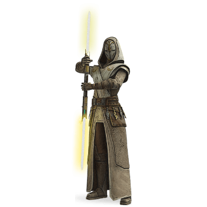

# Sentinella

- [Sentinella](#sentinella)
  - [Privilegi di Classe](#privilegi-di-classe)
    - [Punti Ferita](#punti-ferita)
    - [Competenze](#competenze)
    - [Equipaggiamento](#equipaggiamento)
      - [Variante: ricchezza iniziale](#variante-ricchezza-iniziale)
    - [Forza-lanci](#forza-lanci)
    - [Poteri della Forza Conosciuti](#poteri-della-forza-conosciuti)
    - [Punti Potere](#punti-potere)
    - [Livello Massimo del Potere](#livello-massimo-del-potere)
    - [Caratteristica da forza-lancio](#caratteristica-da-forza-lancio)
    - [Guidato dalla Forza](#guidato-dalla-forza)
    - [Corpo Potenziato dalla Forza](#corpo-potenziato-dalla-forza)
      - [Deflettere](#deflettere)
      - [Doppio Attacco](#doppio-attacco)
      - [Rallentare il Tempo](#rallentare-il-tempo)
    - [Ideali della Sentinella](#ideali-della-sentinella)
    - [Vocazione della Sentinella](#vocazione-della-sentinella)
    - [Aumento dei Punteggi Caratteristica](#aumento-dei-punteggi-caratteristica)
    - [Attacco Extra](#attacco-extra)
    - [Pronto alla Battaglia](#pronto-alla-battaglia)
    - [Elusione Illuminata](#elusione-illuminata)
    - [Centro della Forza](#centro-della-forza)

|Livello|Bonus di Competenza|Privilegi|Poteri della Forza Conosciuti|Punti Potere|Livello Massimo del Potere|Combattimento Cinetico|Ideali Conosciuti|Manifestazioni degli Ideali
|---|---|---|---|---|---|---|---|---
|1|+2|Forza-Lancio, Guidato dalla Forza|7|3|1|-|-|-
|2|+2|Corpo Potenziato dalla Forza, Ideali della Sentinella|9|6|1|d4|2|2
|3|+2|Vocazione della Sentinella|11|9|2|d4|2|2
|4|+2|Aumento dei Punteggi Caratteristica|13|12|2|d4|2|2
|5|+3|Attacco Extra|15|15|2|d6|2|2
|6|+3|-|17|18|3|d6|3|2
|7|+3|Privilegio della Vocazione|18|21|3|d6|3|2
|8|+3|Aumento dei Punteggi Caratteristica|19|24|3|d6|3|2
|9|+4|-|21|27|4|d8|3|3
|10|+4|Pronto alla Battaglia|22|30|4|d8|3|3
|11|+4|-|24|33|5|d8|4|3
|12|+4|Aumento dei Punteggi Caratteristica|25|36|5|d8|4|3
|13|+5|Privilegio della Vocazione|26|39|5|d10|4|3
|14|+5|-|28|42|6|d10|4|3
|15|+5|Elusione Illuminata|29|45|6|d10|4|3
|16|+5|Aumento dei Punteggi Caratteristica|30|48|6|d10|4|3
|17|+6|-|32|51|7|d12|4|4
|18|+6|Privilegio della Vocazione|33|54|7|d12|4|4
|19|+6|Aumento dei Punteggi Caratteristica|34|57|7|d12|4|4
|20|+6|Centro della Forza|35|60|7|d12|4|4

## Privilegi di Classe

---

### Punti Ferita

**Dadi Vita:** 1d8 per livello

**Punti Ferita al livello 1:** 8 + modificatore di Costituzione

**Punti Ferita ai Livelli Successivi:** 1d8 (o 5) + modificatore di Costituzione

---

### Competenze

**Armature:** leggere

**Armi:** armi-laser semplici, vibro-armi semplici, armi-laser da guerra con la proprieta' accurata, vibro-armi da guerra con la proprieta' accurata

**Strumenti:** 1 strumento da specialista a scelta

**Tiri Salvezza:** Destrezza, Carisma

**Abilita':** 3 tra: Acrobazia, Addestrare Animali, Intuizione, Intimidire, Percezione, Persuasione, Guidare, Furtivita' e Tecnologia

---

### Equipaggiamento

- (a) 2 armi-laser o vibro-armi semplici | 1 arma-laser o vibro-arma nella quale sei competente
- (a) 1 dotazione da avventuriero | 1 dotazione da esploratore
- 1 strumento da specialista nel quale sei competente
- 1 armatura da combattimento ed uno scudo leggero

#### Variante: ricchezza iniziale

Puoi decidere di non ricevere equipaggiamento dalla tua classe e dal tuo background e di scegliere la ricchezza iniziale in questo modo:

|Classe|Fondi
|---|---
|Sentinella|6d4 x 100 cr

---

### Forza-lanci

Vedi questa sezione per i dettagli sul forza-lancio e questa sezione per la lista dei poteri della forza.

### Poteri della Forza Conosciuti

Impari 7 poteri della forza a scelta e ne impari altri ai livelli superiori (vedi la tabella). Non puoi imparare un potere di livello superiore a quello indicato nella colonna Livello Massimo del Potere e puoi imparare un potere contestualmente a quando acquisisci uno dei suoi prerequisiti.

### Punti Potere

Possiedi un numero di punti potere pari al tuo livello da sentinella x 3 (come indicato nella tabella) + il tuo modificatore di Carisma o Saggezza (scegli tu). Utilizzi questi punti potere per lanciare i poteri della forza. Recuperi tutti i punti potere spesi quando completi un riposo lungo.

### Livello Massimo del Potere

Alcuni poteri della forza possono essere lanciati a livelli superiori utilizzando il numero indicato di punti potere aggiuntivi. Puoi aumentare il livello di un potere fino al numero indicato nella colonna Livello Massimo del Potere della tabella.

Puoi lanciare dei poteri di livello 5, 6 e 7 solamente una volta ogni riposo lungo.

### Caratteristica da forza-lancio

Utilizzi Saggezza per i poteri del lato chiaro della forza, Carisma per i poteri del lato oscuro della forza e Carisma o Saggezza per i poteri universali (scegli tu). Utilizzi questa abilita' ogni volta che un potere fa riferimento alla caratteristica da forza-lancio. Inoltre utilizzi questo modificatore quando devi determinare la CD dei tiri salvezza dei poteri della forza che lanci e quando effettui un attacco con un potere della forza.

**CD del tiro salvezza della forza:** 8 + bonus di competenza + il tuo modificatore di forza-lancio

**Modificatore di attacco della forza:** bonus di competenza + il tuo modificatore di forza-lancio

### Guidato dalla Forza

**Livello:** 1

Puoi aggiungere 1/2 del tuo bonus di competenza a qualsiasi prova di abilita' che gia' non include il bonus di competenza

### Corpo Potenziato dalla Forza

**Livello:** 2

Impari 3 effetti: Deflettere, Doppio Attacco e Rallentare il Tempo.

Ogni effetto costa 1 punto potere ed utilizza il d4, che cambia con l'aumentare dei livelli da sentinella, come elencato nella colonna "Combattimento Cinetico" della tabella.

Puoi utilizzare ogni effetto una sola volta per round

#### Deflettere

Quando sei bersaglio di un attacco, puoi tirare il dado di Combattimento Cinetico ed aggiungere il risultato alla tua CA (non e' un'azione). Puoi farlo prima o dopo che l'attacco venga effettuato ma prima che il Dungeon Master determini se l'attacco sia andato a segno o meno.

#### Doppio Attacco

Quando colpisci una creatura con un attacco con l'arma, puoi tirare il dado di Combattimento Cinetico ed infliggere danni aggiuntivi, dello stesso tipo di danno dell'arma, pari al risultato del tiro

#### Rallentare il Tempo

Quando ti muovi, nel tuo turno, puoi tirare il dado di Combattimento Cinetico per aumentare la tua velocita' di 1.5m x il risultato del tiro, fino alla fine del tuo turno.

### Ideali della Sentinella

**Livello:** 2

Scegli 2 degli ideali descritti in [questa sezione](./Ideali%20della%20Sentinella.md). All'aumentare dei livelli da sentinella potrai scegliere ulteriori ideali, come elencato nella colonna "Ideali Conosciuti" della tabella.

Puoi manifestare i tuoi ideali per 2 volte ed ottieni manifestazioni aggiuntive con l'aumentare dei livelli da sentinella, come elencato nella colonna "Manifestazioni degli Ideali" della tabella.

### Vocazione della Sentinella

**Livello:** 3, 7, 13 e 18

Scegli una delle vocazioni della sentinella, dettagliate in [questa sezione](./Vocazioni%20della%20Sentinella.md).

### Aumento dei Punteggi Caratteristica

**Livello:** 4, 8, 12, 16 e 19

Puoi aumentare un punteggio caratteristica di 2 punti o due punteggi caratteristica di 1 punto. Non puoi aumentare un punteggio caratteristica oltre il 20 con questo privilegio.

### Attacco Extra

**Livello:** 5

Puoi attaccare 2 volte

### Pronto alla Battaglia

**Livello:** 10

Quando effettui l'azione di Schivare o Disimpegno od utilizzi l'azione per lanciare un potere della forza, puoi effettuare un attacco con l'arma con l'azione bonus

### Elusione Illuminata

**Livello:** 15

Quando vieni assoggettato ad un effetto che richiede un tiro salvezza, puoi spendere 2 punti potere per aggiungere il tuo modificatore di Saggezza o Carisma (scegli tu, minimo 1) alla prova. Se superi la prova non ricevi danno, se fallisci la prova ne subisci la meta'.

### Centro della Forza

**Livello:** 20

I punteggi di Destrezza e Saggezza o Carisma aumentano di 2 ed il punteggio massimo di queste caratteristiche aumenta di 2.

Inoltre, una volta per turno, quando tireresti il dado di Combattimento Cinetico, puoi invece scegliere il massimo del dado
