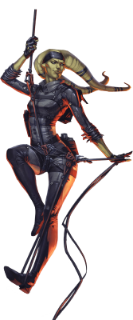

# Twi'lek

## Tratti dei Twi'lek
|||
|---|---
|Aumento dei punteggi caratteristica|Il punteggio di Carisma aumenta di 2 e la Destrezza aumenta di 1
|Eta'|I twi'lek raggiungono la maturita' intorno ai 18 anni e vivono per circa meno di un secolo
|Allineamento|Tendente al lato oscuro della forza
|Taglia|Media
|Velocita'|9m
|Carismatico|Sei competente nelle abilita' di Inganno o Persuasione (segline una)
|Scurovisione|Vedi 18m attraverso luce fioca come se fosse luce intensa e nell'oscurita' come se fosse luce fioca. Nell'oscurita' non vedi i colori, solo gradazioni di grigio
|Ballerino Elegante|Sei competente nell'abilita' di Intrattenere
|Antitossine Innate|Ottieni vantaggio nei tiri salvezza contro l'avvelenamento e la malattia ed ottieni resistenza ai danni da veleno
|Combattere Senz'Armi|I tuoi attacchi senz'armi infliggono 1d4 danni cinetici ed hanno la proprieta' accurata
|Linguaggi|Sai parlare, leggere e scrivere: Galattico Base e Twi'leki. Puoi comunicare non verbalmente con altri tuoi simili attraverso un complesso linguaggio composta da impercettibili movimenti testa-coda
