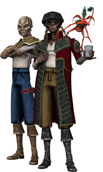

# Indice <!-- omit in toc -->

- [Razze](#razze)
  - [Bith](#bith)
  - [Bothan](#bothan)
  - [Cathar](#cathar)
  - [Cerean](#cerean)
  - [Chiss](#chiss)
  - [Devaronian](#devaronian)
  - [Droide, Classe I](#droide-classe-i)
  - [Droide, Classe II](#droide-classe-ii)
  - [Droide, Classe III](#droide-classe-iii)
  - [Droide, Classe IV](#droide-classe-iv)
  - [Droide, Classe V](#droide-classe-v)
  - [Duros](#duros)
  - [Ewok](#ewok)
  - [Gamorrean](#gamorrean)
  - [Gungan](#gungan)
  - [Ithorian](#ithorian)
  - [Jawa](#jawa)
  - [Kel Dor](#kel-dor)
  - [Mon Calamari](#mon-calamari)
  - [Nautolan](#nautolan)
  - [Rodian](#rodian)
  - [Sith Purosangue](#sith-purosangue)
  - [Togruta](#togruta)
  - [Trandoshan](#trandoshan)
  - [Tusken](#tusken)
  - [Twi'lek](#twilek)
  - [Umano](#umano)
  - [Veequay](#veequay)
  - [Wookiee](#wookiee)
  - [Zabrak](#zabrak)
- [Classi](#classi)
- [Background](#background)
- [Equipaggiamento](#equipaggiamento)
- [Talenti](#talenti)
- [Combattimento](#combattimento)
- [Forza- e Tecno-Lancio](#forza--e-tecno-lancio)
- [Condizioni](#condizioni)

## Razze

### Bith

#### Tratti dei bith <!-- omit in toc -->

|<!-- -->|<!-- -->
|---|---
|Aumento dei punteggi caratteristica|Il punteggio di Intelligenza aumenta di 2 e la Destrezza aumenta di 1
|Eta'|I bith raggiungono la maturita' intorno ai 18 anni e vivono per meno di un secolo
|Allineamento|Tendente al lato chiaro della forza
|Taglia|Media
|Velocita'|9m
|Cura dei Dettagli|Hai vantaggio nelle prove di Intelligenza (Investigazione) effettuate entro 1.5m
|Olfatto Acuto ed Udito Sopraffino|Hai vantaggio nelle prove di Saggezza (Percezione) che riguardano l'olfatto o l'udito
|Musicista|Sei competente nell'utilizzo di uno strumento musicale a scelta
|Programmatore|Ogni volta che effettui una prova di Intelligenza (Tecnologia) che riguarda i computer, va effettuata come so avessi maestria nell'abilita'
|Sensibilita' Sonica|Hai svantaggio sui tiri salvezza contro effetti che infliggerebbero danni sonici
|Trance|Ti bastano 3 ore (invece di 6) per completare un riposo lungo. Qualora il riposo lungo venisse interrotto, per completarlo non devi cominciare da capo, ma puoi riprendere da dove si e' interrotto.
|Linguaggi|Sai parlare, leggere e scrivere: Galattico Base, Bith ed un linguaggio bonus a scelta

### Bothan

#### Tratti dei Bothan <!-- omit in toc -->

|<!-- -->|<!-- -->
|---|---
|Aumento dei punteggi caratteristica|Il punteggio di Intelligenza aumenta di 2 e la Destrezza aumenta di 1
|Eta'|I bothan raggiungono la maturita' intorno ai 18 anni e vivono per meno di un secolo
|Allineamento|Tendente al lato oscuro della forza
|Taglia|Media
|Velocita'|9m
|Furtivita' Innata|Puoi provare a nasconderti anche quando sei occultato da una creatura di taglia uguale o superiore alla tua
|Fuga Agile|Puoi utilizzare le azioni di Disimpegno o Nascondersi come azioni bonus
|Scaltro|Hai vantaggio nelle prove di Intuizione ed Inganno
|Linguaggi|Sai parlare, leggere e scrivere: Galattico Base e Bothese

### Cathar

#### Tratti dei Cathar <!-- omit in toc -->

|<!-- -->|<!-- -->
|---|---
|Aumento dei punteggi caratteristica|Il punteggio di Destrezza aumenta di 2 ed il Carisma aumenta di 1
|Eta'|I cathar raggiungono la maturita' intorno ai 18 anni e vivono per meno di un secolo.
|Allineamento|Neutrale
|Taglia|Media
|Velocita'|9m
|Artigli Felini|I tuoi attacchi senz'armi infliggono 1d6 danni cinetici ed hanno la proprieta' Affilato
|Scurovisione|Vedi 18m attraverso luce fioca come se fosse luce intensa e nell'oscurita' come se fosse luce fioca. Nell'oscurita' non vedi i colori, solo gradazioni di grigio
|Agilita' Leonesca|Puoi raddoppiare la tua velocita in combattimento fino alla fine del turno. Una volta utilizzato questo tratto non puoi utilizzarlo nuovamente finche' non spendi uno dei tuoi turni senza muoverti.
|Passo Felpato|Competenza nell'abilita' Furtivita'
|Arrampicata in Pianta|Velocita' di Scalare 9m. Ottieni vantaggio nei tiri salvezza su Forza e nelle prove di abilita' Forza (Atletica) che coinvolgono lo scalare
|Linguaggi|Sai parlare, leggere e scrivere: Galattico Base e Catharese

### Cerean

#### Tratti dei Cerean <!-- omit in toc -->

|<!-- -->|<!-- -->
|---|---
|Aumento dei punteggi caratteristica|Il punteggio di Intelligenza aumenta di 2 e la Saggezza aumenta di 1
|Eta'|I cerean raggiungono la maturita' intorno ai 18 anni e vivono per meno di un secolo.
|Allineamento|Tendente al lato chiaro della forza.
|Taglia|Media
|Velocita'|9m
|Iniziativa Intuitiva|Puoi ritirare il dado dell'iniziativa, ma devi utilizzare il nuovo risultato
|Istinti Naturali|Sei competente nelle prove di Natura o Percezione (scegline una)
|Predizione|Se esce 1 nei tiri per colpire, prove di abilita' o tiri salvezza, puoi ritirare il dado, ma devi utilizzare il nuovo risultato
|Secondo Cuore|Se vieni mandato a 0 punti ferita e non vieni ucciso, puoi invece rimanere ad 1 punto ferita'. Puoi riutilizzare questo tratto dopo un riposo lungo
|Trance|Ti bastano 3 ore (invece di 6) per completare un riposo lungo. Qualora il riposo lungo venisse interrotto, per completarlo non devi cominciare da capo, ma puoi riprendere da dove si e' interrotto.
|Linguaggi|Sai parlare, leggere e scrivere: Galattico Base e Cerean

### Chiss

#### Tratti dei Chiss <!-- omit in toc -->

|<!-- -->|<!-- -->
|---|---
|Aumento dei punteggi caratteristica|Il punteggio di Intelligenza aumenta di 2 ed il Carisma aumenta di 1
|Eta'|I chiss raggiungono la maturita' intorno ai 18 anni e vivono per meno di un secolo
|Allineamento|Tendente al lato legale oscuro della forza
|Taglia|Media
|Velocita'|9m
|Competenza Marziale|Sei competente nell'utilizzo di armature leggere e medie e nell'utilizzo di pistole pesanti e fucili di precisione
|Avvezzi nella Politica|Sei competente nell'abilita' Intuizione
|Resistenza alla Tecnologia|Ottieni vantaggio nei tiri salvezza su Destrezza ed Intelligenza contro i poteri tecnologici
|Scurovisione Migliorata|Vedi 36m attraverso luce fioca come se fosse luce intensa e nell'oscurita' come se fosse luce fioca. Nell'oscurita' non vedi i colori, solo gradazioni di grigio
|Linguaggi|Sai parlare, leggere e scrivere: Galattico base, Cheunh ed uno a scelta tra Minnisiat o Sy Bisti

### Devaronian

#### Tratti dei Devaronian <!-- omit in toc -->

|<!-- -->|<!-- -->
|---|---
|Aumento dei punteggi caratteristica|Il punteggio di Costituzione aumenta di 2 ed il Carisma aumenta di 1
|Eta'|I devaronian raggiungono la maturita' intorno ai 18 anni e vivono per meno di un secolo
|Allineamento|Tendente al caotico neutrale
|Taglia|Media
|Velocita'|9m
|Curiosita'|Sei competente nelle prove di Sopravvivenza od Indagare (scegline una)
|Acclimazione al Caldo|Ottieni vantaggio nei tiri salvezza su Costituzione contro l'esaurimento causato dal caldo intenso
|Abitante della Giungla|La giungla, per te, non risulta come terreno difficile
|Eloquenza|Sei competente nelle prove di Inganno o Persuasione (scegline una)
|Resistenza alla Tecnologia|Ottieni vantaggio nei tiri salvezza su Destrezza ed Intelligenza contro i poteri tecnologici
|Due Fegati|Ottieni vantaggio nei tiri salvezza contro l'avvelenamento e sei resistente ai danni da veleno
|Linguaggi|Sai parlare, leggere e scrivere: Galattico Base e Devaronese

### Droide, Classe I

#### Tratti del Droide, Classe I <!-- omit in toc -->

|<!-- -->|<!-- -->
|---|---
|Aumento dei punteggi caratteristica|Il punteggio di Intelligenza aumenta di 2 e la Saggezza od il Carisma aumentano di 1
|Eta'|I droidi non invecchiano, ma hanno bisogno di manutenzione per continuare a funzionare
|Allineamento|Neutrale
|Taglia|Media
|Velocita'|7.5m
|Tipo|Il tuo tipo di creatura e' considerato: droide
|Armatura Integrata|Non puoi indossare un'armatura ma puo' essere integrata nel tuo telaio durante un riposo lungo. Questa operazione deve essere effettuata da qualcuno competente negli strumenti astro-tecnologici. Devi essere competente nel tipo di armatura che decidi di installare
|Resistenze dei Droidi|Sei resistente ai danni di tipo: necrotico, veleno e psichico. Sei immune all'avvelenamento ed alle malattie
|Sistemi dei Droidi|Non hai bisogno di mangiare, bere o respirare. Inoltre non hai bisogno di possedere un tecno-focus per lanciare poteri tecnologici
|Vulnerabilita' dei Droidi|Sei vulnerabile ai danni di tipo: ionico. Inoltre subisci svantaggio nei tiri salvezza contro effetti che infliggerebbero danni ionici od elettrici
|Insensibilita' alla Forza|Non puoi utilizzare poteri della forza o prendere livelli in classi che usano il forza-lancio
|Protocollo del Sapere|Sei competente due abilita' basate su Intelligenza, Saggezza o Carisma a scelta
|Modalita' Mantenimento|Invece di dormire, devi spendere 3 ore eseguendo un sottoprogramma di mantenimento durante un riposo lungo per ottenerne i benefici. Durante questa fase subisci svantaggio delle prove di Saggezza (Percezione). Qualora il riposo lungo venisse interrotto, per completarlo non devi cominciare da capo, ma puoi riprendere da dove si e' interrotto
|Ricostruzione Rapida|Come azione bonus puoi spendere uno o piu' Dadi Vita per recuperare punti ferita
|Linguaggi|Sai parlare, leggere e scrivere: Galattico Base ed un linguaggio bonus a piacere. Sei in grado di comprendere il linguaggio Binario scritto e parlato, ma non sai parlarlo

### Droide, Classe II

#### Tratti del Droide, Classe II <!-- omit in toc -->

|<!-- -->|<!-- -->
|---|---
|Aumento dei punteggi caratteristica|Il punteggio di Intelligenza aumenta di 2 e la Destrezza o la Saggezza aumentano di 1
|Eta'|I droidi non invecchiano, ma hanno bisogno di manutenzione per continuare a funzionare
|Allineamento|Neutrale
|Taglia|Piccola
|Velocita'|7.5m
|Tipo|Il tuo tipo di creatura e' considerato: droide
|Armatura Integrata|Non puoi indossare un'armatura ma puo' essere integrata nel tuo telaio durante un riposo lungo. Questa operazione deve essere effettuata da qualcuno competente negli strumenti astro-tecnologici. Devi essere competente nel tipo di armatura che decidi di installare
|Resistenze dei Droidi|Sei resistente ai danni di tipo: necrotico, veleno e psichico. Sei immune all'avvelenamento ed alle malattie
|Sistemi dei Droidi|Non hai bisogno di mangiare, bere o respirare. Inoltre non hai bisogno di possedere un tecno-focus per lanciare poteri tecnologici
|Vulnerabilita' dei Droidi|Sei vulnerabile ai danni di tipo: ionico. Inoltre subisci svantaggio nei tiri salvezza contro effetti che infliggerebbero danni ionici od elettrici
|Insensibilita' alla Forza|Non puoi utilizzare poteri della forza o prendere livelli in classi che usano il forza-lancio
|Ingegneria Integrata|Sei competente in un kit da specialista a scelta. Il kit scelto e' integrato nel tuo telaio e non puo' essere rimosso finche' rimani cosciente
|Modalita' Mantenimento|Invece di dormire, devi spendere 3 ore eseguendo un sottoprogramma di mantenimento durante un riposo lungo per ottenerne i benefici. Durante questa fase subisci svantaggio delle prove di Saggezza (Percezione). Qualora il riposo lungo venisse interrotto, per completarlo non devi cominciare da capo, ma puoi riprendere da dove si e' interrotto
|Ricostruzione Rapida|Come azione bonus puoi spendere uno o piu' Dadi Vita per recuperare punti ferita
|Protocollo delle Abilita'|Sei competente in due abilita' a scelta
|Sottodimensionato|Non puoi utilizzare scudi pesanti, armi da guerra con la proprieta' a due mani a meno che non abbiano anche la proprieta' leggera e se un'arma da guerra ha la proprieta' versatile, puoi impugnarla solo a due mani
|Linguaggi|Sai parlare, leggere e scrivere: Binario. Comprendi il Galattico Base parlato ed un linguaggio bonus a scelta, ma non sai parlarli

### Droide, Classe III

#### Tratti del Droide, Classe III <!-- omit in toc -->

|<!-- -->|<!-- -->
|---|---
|Aumento dei punteggi caratteristica|Il punteggio di Carisma aumenta di 2 ed Intelligenza o Saggezza aumentano di 1
|Eta'|I droidi non invecchiano, ma hanno bisogno di manutenzione per continuare a funzionare
|Allineamento|Neutrale
|Taglia|Media
|Velocita'|7.5m
|Tipo|Il tuo tipo di creatura e' considerato: droide
|Armatura Integrata|Non puoi indossare un'armatura ma puo' essere integrata nel tuo telaio durante un riposo lungo. Questa operazione deve essere effettuata da qualcuno competente negli strumenti astro-tecnologici. Devi essere competente nel tipo di armatura che decidi di installare
|Resistenze dei Droidi|Sei resistente ai danni di tipo: necrotico, veleno e psichico. Sei immune all'avvelenamento ed alle malattie
|Sistemi dei Droidi|Non hai bisogno di mangiare, bere o respirare. Inoltre non hai bisogno di possedere un tecno-focus per lanciare poteri tecnologici
|Vulnerabilita' dei Droidi|Sei vulnerabile ai danni di tipo: ionico. Inoltre subisci svantaggio nei tiri salvezza contro effetti che infliggerebbero danni ionici od elettrici
|Insensibilita' alla Forza|Non puoi utilizzare poteri della forza o prendere livelli in classi che usano il forza-lancio
|Protocollo del Sapere|Sei competente nell'abilita' Storia
|Modalita' Mantenimento|Invece di dormire, devi spendere 3 ore eseguendo un sottoprogramma di mantenimento durante un riposo lungo per ottenerne i benefici. Durante questa fase subisci svantaggio delle prove di Saggezza (Percezione). Qualora il riposo lungo venisse interrotto, per completarlo non devi cominciare da capo, ma puoi riprendere da dove si e' interrotto
|Ricostruzione Rapida|Come azione bonus puoi spendere uno o piu' Dadi Vita per recuperare punti ferita
|Linguaggi|Sai parlare, leggere e scrivere tutti i linguaggi censiti

### Droide, Classe IV

#### Tratti del Droide, Classe IV <!-- omit in toc -->

|<!-- -->|<!-- -->
|---|---
|Aumento dei punteggi caratteristica|Il punteggio di Costituzione aumenta di 2 e Forza o Destrezza aumentano di 1
|Eta'|I droidi non invecchiano, ma hanno bisogno di manutenzione per continuare a funzionare
|Allineamento|Neutrale
|Taglia|Media
|Velocita'|9m
|Tipo|Il tuo tipo di creatura e' considerato: droide
|Armatura Integrata|Non puoi indossare un'armatura ma puo' essere integrata nel tuo telaio durante un riposo lungo. Questa operazione deve essere effettuata da qualcuno competente negli strumenti astro-tecnologici. Devi essere competente nel tipo di armatura che decidi di installare
|Resistenze dei Droidi|Sei resistente ai danni di tipo: necrotico, veleno e psichico. Sei immune all'avvelenamento ed alle malattie
|Sistemi dei Droidi|Non hai bisogno di mangiare, bere o respirare. Inoltre non hai bisogno di possedere un tecno-focus per lanciare poteri tecnologici
|Vulnerabilita' dei Droidi|Sei vulnerabile ai danni di tipo: ionico. Inoltre subisci svantaggio nei tiri salvezza contro effetti che infliggerebbero danni ionici od elettrici
|Insensibilita' alla Forza|Non puoi utilizzare poteri della forza o prendere livelli in classi che usano il forza-lancio
|Modalita' Mantenimento|Invece di dormire, devi spendere 3 ore eseguendo un sottoprogramma di mantenimento durante un riposo lungo per ottenerne i benefici. Durante questa fase subisci svantaggio delle prove di Saggezza (Percezione). Qualora il riposo lungo venisse interrotto, per completarlo non devi cominciare da capo, ma puoi riprendere da dove si e' interrotto
|Protocollo Marziale|Sei competente nell'utilizzo di armature leggere e medie ed in due blaster semplici o da guerra o vibro-armi a scelta
|Ricostruzione Rapida|Come azione bonus puoi spendere uno o piu' Dadi Vita per recuperare punti ferita
|Linguaggi|Sai parlare, leggere e scrivere: Galattico Base ed un linguaggio Bonus a scelta. Sei in grado di comprendere il linguaggio Binario scritto e parlato, ma non sai parlarlo

### Droide, Classe V

#### Tratti del Droide, Classe V <!-- omit in toc -->

|<!-- -->|<!-- -->
|---|---
|Aumento dei punteggi caratteristica|Il punteggio di Forza aumenta di 2 e la Destrezza o Costituzione aumentano di 1
|Eta'|I droidi non invecchiano, ma hanno bisogno di manutenzione per continuare a funzionare
|Allineamento|Neutrale
|Taglia|Media
|Velocita'|9m
|Tipo|Il tuo tipo di creatura e' considerato: droide
|Armatura Integrata|Non puoi indossare un'armatura ma puo' essere integrata nel tuo telaio durante un riposo lungo. Questa operazione deve essere effettuata da qualcuno competente negli strumenti astro-tecnologici. Devi essere competente nel tipo di armatura che decidi di installare
|Resistenze dei Droidi|Sei resistente ai danni di tipo: necrotico, veleno e psichico. Sei immune all'avvelenamento ed alle malattie
|Sistemi dei Droidi|Non hai bisogno di mangiare, bere o respirare. Inoltre non hai bisogno di possedere un tecno-focus per lanciare poteri tecnologici
|Vulnerabilita' dei Droidi|Sei vulnerabile ai danni di tipo: ionico. Inoltre subisci svantaggio nei tiri salvezza contro effetti che infliggerebbero danni ionici od elettrici
|Insensibilita' alla Forza|Non puoi utilizzare poteri della forza o prendere livelli in classi che usano il forza-lancio
|Modalita' Mantenimento|Invece di dormire, devi spendere 3 ore eseguendo un sottoprogramma di mantenimento durante un riposo lungo per ottenerne i benefici. Durante questa fase subisci svantaggio delle prove di Saggezza (Percezione). Qualora il riposo lungo venisse interrotto, per completarlo non devi cominciare da capo, ma puoi riprendere da dove si e' interrotto
|Manovale|Sei competente nella abilita' di Atletica e nell'utilizzo di una dotazione da artigiano a scelta
|Stazza Prestante|La capacita' di carico, spingere, trascinare o sollevare un peso vengono duplicate. Se sono gia' duplicate, allora triplicale
|Ricostruzione Rapida|Come azione bonus puoi spendere uno o piu' Dadi Vita per recuperare punti ferita
|Linguaggi|Sai parlare, leggere e scrivere: Binario. Comprendi il Galattico Base parlato ed un linguaggio bonus a scelta, ma non sai parlarli

### Duros

#### Tratti dei Duros <!-- omit in toc -->

|<!-- -->|<!-- -->
|---|---
|Aumento dei punteggi caratteristica|Il punteggio di Destrezza aumenta di 2 e l'Intelligenza aumenta di 1
|Eta'|I duros raggiungono la maturita' intorno ai 20 anni e vivono fino a circa 150 anni
|Allineamento|Neutrale
|Taglia|Media
|Velocita'|9m
|Scurovisione|Vedi 18m attraverso luce fioca come se fosse luce intensa e nell'oscurita' come se fosse luce fioca. Nell'oscurita' non vedi i colori, solo gradazioni di grigio
|Viaggiatore Galattico|Sei competente nelle abilita' Pilotare e Storia
|Navigatore|Sei competente nell'utilizzo degli attrezzi da geometra
|Memoria Superiore|Puoi raddoppiare il bonus di competenza quando effettui delle prove di Intelligenza (Storia) per ricordare informazioni delle quali sei venuto a conoscenza o per ricordare i dettagli delle varie esperienze vissute
|Resistenza alla Tecnologia|Ottieni vantaggio nei tiri salvezza su Destrezza ed Intelligenza contro i poteri tecnologici
|Linguaggi|Sai parlare, leggere e scrivere: Galattico Base e Durese

### Ewok

#### Tratti degli Ewok <!-- omit in toc -->

|<!-- -->|<!-- -->
|---|---
|Aumento dei punteggi caratteristica|Il punteggio di Destrezza aumenta di 2 e la Costituzione aumenta di 1
|Eta'|Gli ewok raggiungono la maturita' intorno ai 13 anni e vivono fino a circa 50 anni
|Allineamento|Tendente al lato chiaro della forza
|Taglia|Piccola
|Velocita'|7.5m
|Specialisti di Armi Improvvisate|Puoi spendere 1 ora, anche nel mezzo di un riposo breve, per creare un'arma con materiali trovati nei dintorni. Puoi creare un'arma cinetica semplice ma il danno dell'arma subisce una penalita' di -1
|Olfatto Acuto|Ottieni vantaggio nelle prove di Saggezza (Percezione) che comprendono l'utilizzo dell'olfatto
|Maschera Selvatica|Puoi nascondersi anche se sei parzialmente oscurato da: fogliame, pioggia fitta, nevicate, nebbia ed altri fenomeni naturali simili
|Cultura Musicale|Sei competente nell'utilizzo di uno strumento a scelta
|Survivalista Innato|Sei competente nelle prove di Natura e Sopravvivenza
|Arrampicata in Pianta|Velocita' di Scalare 7.5m. Ottieni vantaggio nei tiri salvezza su Forza e nelle prove di abilita' Forza (Atletica) che coinvolgono lo scalare
|Sottodimensionato|Non puoi utilizzare scudi pesanti, armi da guerra con la proprieta' a due mani a meno che non abbiano anche la proprieta' leggera e se un'arma da guerra ha la proprieta' versatile, puoi impugnarla solo a due mani
|Linguaggi|Sai parlare, leggere e scrivere Ewokese. Sei in grado di comprendere il Galattico Base parlato e scritto ma non sai parlarlo

### Gamorrean

#### Tratti dei Gamorrean <!-- omit in toc -->

|<!-- -->|<!-- -->
|---|---
|Aumento dei punteggi caratteristica|Il punteggio di Forza aumenta di 2 e la Costituzione di 1
|Eta'|I gamorrean raggiungono la maturita' intorno ai 13 anni e vivono fino a circa 70 anni
|Allineamento|Caotico neutrale
|Taglia|Media
|Velocita'|9m
|Robustezza Gamorreana|I tuoi punti ferita massimi aumentano di 1 ed aumentano di 1 punto ogni volta che guadagni un livello. Inoltre ottieni vantaggio nei tiri salvezza su Costituzione
|Armi Gamorreane|Sei competente nell'utilizzo delle armi: vibro-ascia, vibro-mazza e vibro-spada
|Attacchi Selvaggi|Se infliggi un danno critico con un'arma corpo a corpo puoi tirare uno dei dadi del danno dell'arma una volta in piu' ed aggiungerlo al danno extra del colpo critico
|Linguaggi|Sai parlare, leggere e scrivere Gamorrese. Sei in grado di comprendere il Galattico Base, ma non sai parlarlo

### Gungan

#### Tratti dei Gungan <!-- omit in toc -->

|<!-- -->|<!-- -->
|---|---
|Aumento dei punteggi caratteristica|Il punteggio di Destrezza aumenta di 2 e la Forza aumenta di 1
|Eta'|I gungan raggiungono la maturita' intorno ai 13 anni e vivono fino a circa 70 anni
|Allineamento|Tendente al lato chiaro della forza
|Taglia|Media
|Velocita'|9m
|Anfibio|Puoi respirare sott'acqua
|Scurovisione|Vedi 18m attraverso luce fioca come se fosse luce intensa e nell'oscurita' come se fosse luce fioca. Nell'oscurita' non vedi i colori, solo gradazioni di grigio.
|Flessibile|Ottieni vantaggio nelle prove di Destrezza (Acrobazia) basate sulla flessibilita'
|Sensibilita' al Caldo|Subisci svantaggio nei tiri salvezza su Costituzione contro l'esaurimento causato dal caldo intenso.
|Competenza Marziale|Sei competente nell'utilizzo di armature leggere e medie e nell'utilizzo delle armi: tecno-bastone e vibro-lancia
|Gambe Forti|Quando effettui un salto orizzontale, percorri un numero di metri pari al tuo punteggio di Forza diviso 4 (arrotondato per eccesso al piu' vicino multiplo di 1.5). Quando effettui un salto in verticale il numero di metri del tuo balzo e' 3 + due volte il modificatore di Forza
|Nuotare|Ottieni velocita' di nuotare 9m
|Linguaggi|Sai parlare, leggere e scrivere: Galattico Base e Grungan. Quando parli il Galattico Base trovi difficolta' nel pronunciare alcune parole o coniugare alcuni verbi.

### Ithorian

#### Tratti degli Ithorian <!-- omit in toc -->

|<!-- -->|<!-- -->
|---|---
|Aumento dei punteggi caratteristica|Il punteggio di Carisma aumenta di 2 e la Saggezza aumenta di 1
|Eta'|Gli ithorian raggiungono la maturita intorno ai 18 anni e vivono fino a circa 85 anni
|Allineamento|Tendente al lato chiaro della forza
|Taglia|Media
|Velocita'|9m
|Invocare la Pace|Con un'azione, nel tuo turno, puoi distrarre tutti i nemici che sono in grado di vederti entro 3m. Tutti i nemici influenzati nel raggio subiscono svantaggio ai tiri per colpire contro i tuoi alleati, fino alla fine del tuo prossimo turno. Puoi riutilizzare questo tratto dopo aver terminato un riposo breve o lungo
|Trattenere il Respiro|Puoi trattenere il respiro per 15 minuti alla volta
|Legge di Vita|Sei competente nell'abilita' Natura e nei kit di bio-analisi
|Urlo Sonico|Con un'azione, espelli violentemente l'aria in un cono di 4.5m. Ogni creatura nell'area deve superare un tiro salvezza su Saggezza (CD = 8 + bonus di competenza + il tuo modificatore di Costituzione). Chi fallisce subisce 2d6 danni sonici, chi supera ne riceve la meta'. I danni aumentano a 4d6 al livello 5, 6d6 al livello 11 e 8d6 al livello 17. Questa abilita' non ha effetto contro i costrutti. Puoi utilizzare questo tratto tante volte quanto il tuo bonus di competenza. Recuperi tutti gli utilizzi spesi dopo aver terminato un riposo lungo
|Linguaggi|Sai parlare, leggere e scrivere: Ithorese. Sei in grado di comprendere il Galattico Base ma non sai parlarlo

### Jawa

#### Tratti dei Jawa <!-- omit in toc -->

|<!-- -->|<!-- -->
|---|---
|Aumento dei punteggi caratteristica|Il tuo punteggio di Destrezza aumenta di 2 e l'Intelligenza aumenta di 1
|Eta'|I jawa vengono considerati degli adulti quando portano a termina la prima vendita e vivono per meno di un secolo
|Allineamento|Tendente al lato oscuro della forza
|Taglia|Piccola
|Velocita'|7.5m
|Scurovisione|Vedi 18m attraverso luce fioca come se fosse luce intensa e nell'oscurita' come se fosse luce fioca. Nell'oscurita' non vedi i colori, solo gradazioni di grigio
|Strisciare, Rannicchiarsi ed Elemosinare| Con un'azione, nel tuo turno, puoi rannicchiarti pateticamente per distrarre i tuoi nemici. Fino alla fine del tuo prossimo turno i tuoi alleati guadagnano vantaggio nei tiri per colpire contro tutti i nemici che, entro 3m da te, sono in grado di vederti. Puoi utilizzare nuovamente questo tratto una volta completato un riposo breve o lungo
|Acclimazione al Caldo|Ottieni vantaggio nei tiri salvezza su Costituzione contro l'esaurimento causato dal caldo intenso
|Neofita Tecnologico|Conosci il potere tecnologico, a volonta', Esplosione di Ioni (Ion Blast). Raggiunto il livello 3 impari il potere tecnologico Riparare Droidi (Repair Droid) che puoi lanciare una volta per riposo lungo. Al livello 5 impari il potere tecnologico Bloccare Droide (Hold Droid) che puoi lanciare una volta per riposo lungo. La caratteristica di tecno-lancio e' Intelligenza. Non hai bisogno di un computerino da polso per lanciare questi poteri
|Furfanteria|Sei competente nell'abilita' Rapidita' di Mano
|Armeggiare|Sei competente nell'utilizzo delle dotazioni da armeggiatore. Puoi spendere 1 ora e materiali dal valore di 100cr per costruire un Dispositivo Minuscolo (CA 5, 1 PF). Puoi utilizzare l'azione di prendere un oggetto per far eseguire al dispositivo una delle seguenti azioni: creare una piccola esplosione, creare un suono assordante continuo per 1 minuto, creare del fumo per 1 minuto, causare un piccolo incendio elettrico. Puoi manutenere un numero di questi dispositivi, contemporaneamente, pari al bonus di competenza. Un dispositivo smette di funzionare se e' lontano da te per piu' di 24h. Puoi smantellare un dispositivo per recuperare i materiali utilizzati per crearlo
|Sottodimensionato|Non puoi utilizzare scudi pesanti, armi da guerra con la proprieta' a due mani a meno che non abbiano anche la proprieta' leggera e se un'arma da guerra ha la proprieta' versatile, puoi impugnarla solo a due mani
|Linguaggi|Sai parlare, leggere e scrivere Jawaese (ed il Linguaggio di Commercio Jawa). Sei in grado di comprendere il Galattico Base scritto e parlato ma non sai parlarlo

### Kel Dor

#### Tratti dei Kel Dor <!-- omit in toc -->

|<!-- -->|<!-- -->
|---|---
|Aumento dei punteggi caratteristica|Il punteggio di Saggezza aumenta di 2 e la Destrezza di 1
|Eta'|I kel dor raggiungono la maturita' intorno ai 18 anni e vivono per meno di un secolo
|Allineamento|Legale neutrale
|Taglia|Media
|Velocita'|9m
|Scurovisione|Vedi 18m attraverso luce fioca come se fosse luce intensa e nell'oscurita' come se fosse luce fioca. Nell'oscurita' non vedi i colori, solo gradazioni di grigio
|Biologia Aliena|Non puoi respirare ossigeno. Utilizzi un respiratore per negare gli effetti negativi dell'ossigeno. Se ti viene rimosso il respiratore in un ambiente con presenza d'ossigeno perdi conoscenza
|Vita nel Vuoto|Sei resistente ai danni necrotici. Se vieni esposto al vuoto dello spazio sei in grado di sopravvivere un numero di ore pari al tuo modificatore di Costituzione (minimo 1h) anziche' il solito numero di round.
|Telepatia|Sei in grado di comunicare telepaticamente con le creature che si trovano entro 9m da te. Devi condividere un linguaggio con la creatura per poterci comunicare
|Linguaggi|Sai parlare, leggere e scrivere: Galattico Base e Kel Dor

### Mon Calamari

#### Tratti dei Mon Calamari <!-- omit in toc -->

|<!-- -->|<!-- -->
|---|---
|Aumento dei punteggi caratteristica|Il punteggio di Carisma aumenta di 2 e l'Intelligenza o la Saggezza aumentano di 1
|Eta'|I mon calamari raggiungono la maturita' intorno ai 18 anni e vivono per meno di un secolo
|Allineamento|Tendente al lato chiaro della forza
|Taglia|Media
|Velocita'|9m
|Anfibio|Puoi respirare sott'acqua
|Scurovisione|Vedi 18m attraverso luce fioca come se fosse luce intensa e nell'oscurita' come se fosse luce fioca. Nell'oscurita' non vedi i colori, solo gradazioni di grigio
|Resistenza dei Mon Calamari|Ottieni vantaggio nei tiri salvezza contro gli effetti di lentezza e sei resistente ai danni da freddo
|Appassionato di Musica|Sei competente nell'utilizzo di uno strumento musicale a scelta
|Nuotare|Ottieni velocita' di nuotare 9m
|Linguaggi|Sai parlare, leggere e scrivere: Galattico Base, Mon Cal ed un linguaggio bonus a piacere

### Nautolan

#### Tratti dei Nautolan <!-- omit in toc -->

|<!-- -->|<!-- -->
|---|---
|Aumento dei punteggi caratteristica|Il punteggio di Destrezza aumenta di 2 e la Saggezza aumenta di 1
|Eta'|I nautolan raggiungono la maturita' intorno ai 13 anni e vivono fino a circa 70 anni
|Allineamento|Tendente al lato chiaro della forza
|Taglia|Media
|Velocita'|9m
|Olfatto Sopraffino|Ogni volta che effettui una prova di Saggezza (Percezione) che comprende l'utilizzo dell'olfatto, va effettuata come so avessi maestria nell'abilita'
|Anfibio|Puoi respirare sott'acqua
|Scurovisione|Vedi 18m attraverso luce fioca come se fosse luce intensa e nell'oscurita' come se fosse luce fioca. Nell'oscurita' non vedi i colori, solo gradazioni di grigio
|Pelle Dura|Quando non indossi alcuna armatura o ne indossi una leggera, la tua CA e' 12 + il modificatore di Destrezza
|Empatia Innata|Ottieni vantaggio nelle prove di Saggezza (Intuizione) effettuate per comprendere le emozioni di umanoidi o bestie che si trovano entro 3m da te
|Nuotare|Ottieni velocita' di nuotare 9m
|Linguaggi|Sai parlare, leggere e scrivere: Galattico Base e Nautila

### Rodian

#### Tratti dei Rodian <!-- omit in toc -->

|<!-- -->|<!-- -->
|---|---
|Aumento dei punteggi caratteristica|Il punteggio di Destrezza aumenta di 2 e la Costituzione aumenta di 1
|Eta'|I rodian raggiungono la maturita' intorno ai 18 anni e vivono per meno di un secolo
|Allineamento|Tendente al lato oscuro della forza
|Taglia|Media
|Velocita'|9m
|Scalatore Provetto|Velocita' di scalare 9m
|Scurovisione|Vedi 18m attraverso luce fioca come se fosse luce intensa e nell'oscurita' come se fosse luce fioca. Nell'oscurita' non vedi i colori, solo gradazioni di grigio
|Olfatto Acuto ed Udito Sopraffino|Hai vantaggio nelle prove di Saggezza (Percezione) che riguardano l'olfatto o l'udito
|Cacciatore Imperscrutabile|Sei competente nelle abilita' di Sopravvivenza e Furtivita'
|Linguaggi|Sai parlare, leggere e scrivere: Galattico Base e Rodese. I rodian sono in grado di comunicare tra di loro utilizzando dei feromoni. I sensitivi della forza sono in grado di individuare queste comunicazioni ma non sono in grado di comprenderne il contenuto

### Sith Purosangue

#### Tratti dei Sith Purosangue <!-- omit in toc -->

|<!-- -->|<!-- -->
|---|---
|Aumento dei punteggi caratteristica|Il punteggio di Carisma aumenta di 2 e la Forza o la Destrezza aumentano di 1
|Eta'|I sith raggiungono la maturita' intorno ai 18 anni e vivono per meno di un secolo
|Allineamento|Lato caotico oscuro della forza
|Taglia|Media
|Velocita'|9m
|Scurovisione|Vedi 18m attraverso luce fioca come se fosse luce intensa e nell'oscurita' come se fosse luce fioca. Nell'oscurita' non vedi i colori, solo gradazioni di grigio
|Sensitivo della Forza|Conosci il potere della forza, a volonta', Denuncia (Denounce). Raggiunto il livello 3 impari il potere della forza Maledizione (Curse) che puoi lanciare una volta per riposo lungo. Al livello 5 impari il potere della forza Conferire Maledizione (Bestow Curse) che puoi lanciare una volta per riposo lungo. La caratteristica di forza-lancio e' Carisma.
|Sensi Acuti|Sei competente nell'abilita' di Percezione
|Minaccioso|Sei competente nell'abilita' di Intimidire
|Linguaggi|Sai parlare, leggere e scrivere: Galattico Base e Sith

### Togruta

#### Tratti dei Togruta <!-- omit in toc -->

|<!-- -->|<!-- -->
|---|---
|Aumento dei punteggi caratteristica|Il punteggio di Saggezza aumenta di 2 e la Forza o la Destrezza aumentano di 1
|Eta'|I togruta raggiungono la maturita' intorno ai 18 anni e vivono per circa meno di un secolo
|Allineamento|Tendente al lato chiaro della forza
|Taglia|Media
|Velocita'|9m
|Maschera Selvatica|Puoi nascondersi anche se sei parzialmente oscurato da: fogliame, pioggia fitta, nevicate, nebbia ed altri fenomeni naturali simili
|Montral Recettivi|Ottieni percezione tellurica 9m. Sei in grado di identificare precisamente l'origine delle vibrazioni fintanto che tu e la sorgente siate sulla stessa superficie o sostanza. Percezione tellurica non puo' essere utilizzata per identificare creature volanti od incorporee
|Cacciatore Selvatico|Sei competente nell'abilita' di Sopravvivenza
|Linguaggi|Sai parlare, leggere e scrivere: Galattico Base e Troguti

### Trandoshan

.png)

#### Tratti dei Trandoshan <!-- omit in toc -->

|<!-- -->|<!-- -->
|---|---
|Aumento dei punteggi caratteristica|Il punteggio di Forza aumenta di 2 e la Saggezza aumenta di 1
|Eta'|I trandoshan raggiungono la maturita' intorno ai 13 anni e vivono fino a circa 70 anni
|Allineamento|Tendente al lato oscuro della forza
|Taglia|Media
|Velocita'|9m
|Artigli|I tuoi artigli vengono considerati un'arma naturale. I tuoi attacchi senz'armi infliggono 1d4 danni cinetici
|Scurovisione|Vedi 18m attraverso luce fioca come se fosse luce intensa e nell'oscurita' come se fosse luce fioca. Nell'oscurita' non vedi i colori, solo gradazioni di grigio
|Pelle Dura|Quando non indossi alcuna armatura o ne indossi una leggera, la tua CA e' 12 + il modificatore di Destrezza
|Rigenerativo|Quando subisci dei danni puoi utilizzare la tua reazione per spendere un dado vita e recuperare dei punti ferita, ammesso che i danni subiti non riducano i tuoi punti ferita a 0
|Salvare la Faccia|Se fallisci un tiro per colpire, una prova di abilita' od un tiro salvezza puoi decidere di applicare un bonus al tiro pari al numero di alleati che puoi vedere in un raggio di 9m (bonus massimo +5). Puoi utilizzare nuovamente questo tratto dopo aver terminato un riposo breve o lungo.
|Linguaggi|Sai parlare, leggere e scrivere: Galattico Base e Dosh

### Tusken

#### Tratti dei Tusken <!-- omit in toc -->

|<!-- -->|<!-- -->
|---|---
|Aumento dei punteggi caratteristica|Il punteggio di Costituzione aumenta di 2 e la Forza od il Carisma aumentano di 1
|Eta'|I tusken sono considerati adulti a 15 anni. Per colpa del clima ostile del loro mondo d'origine raramente vivono per piu' di meta' secolo
|Allineamento|Lato caotico oscuro della forza
|Taglia|Media
|Velocita'|9m
|Aggressivo|Con un'azione bonus puoi muoverti fino al massimo della tua velocita' verso un nemico che sei in grado di vedere o sentire. Se decidi di utilizzare questo tratto devi terminare il turno in uno spazio piu' vicino possibile al nemico di quando hai iniziato il turno
|Addestratore di Animali|Sei competente nell'abilita' di Addestrare Animali
|Ruggito Minaccioso|Una volta al giorno puoi lanciare il potere della forza Paura (Fear). Il carisma e' la caratteristica di forza-lancio.
|Sopravvissuto delle Sabbie|Sei competente nell'abilita' di Sopravvivenza ed il deserto, per te, non risulta come terreno difficile. Infine, ottieni vantaggio nei tiri salvezza su Costituzione contro l'esaurimento causato dal caldo estremo
|Riluttanza Tecnologica|Non puoi utilizzare poteri tecnologici o prendere livelli in classi con tecno-lancio
|Armi Tusken|Sei competente nelle armi: fucile cycler, vibro-ascia
|Linguaggi|Sai parlare Tusken e sai parlare, leggere e scrivere: Galattico Base. Il Tusken non ha una forma scritta. I tusken conoscono un complesso linguaggio dei segni che utilizzano per comunicare tra simili in modo silenzioso

### Twi'lek

#### Tratti dei Twi'lek <!-- omit in toc -->

|<!-- -->|<!-- -->
|---|---
|Aumento dei punteggi caratteristica|Il punteggio di Carisma aumenta di 2 e la Destrezza aumenta di 1
|Eta'|I twi'lek raggiungono la maturita' intorno ai 18 anni e vivono per circa meno di un secolo
|Allineamento|Tendente al lato oscuro della forza
|Taglia|Media
|Velocita'|9m
|Carismatico|Sei competente nelle abilita' di Inganno o Persuasione (segline una)
|Scurovisione|Vedi 18m attraverso luce fioca come se fosse luce intensa e nell'oscurita' come se fosse luce fioca. Nell'oscurita' non vedi i colori, solo gradazioni di grigio
|Ballerino Elegante|Sei competente nell'abilita' di Intrattenere
|Antitossine Innate|Ottieni vantaggio nei tiri salvezza contro l'avvelenamento e la malattia ed ottieni resistenza ai danni da veleno
|Combattere Senz'Armi|I tuoi attacchi senz'armi infliggono 1d4 danni cinetici ed hanno la proprieta' accurata
|Linguaggi|Sai parlare, leggere e scrivere: Galattico Base e Twi'leki. Puoi comunicare non verbalmente con altri tuoi simili attraverso un complesso linguaggio composta da impercettibili movimenti testa-coda

### Umano

#### Tratti degli Umani <!-- omit in toc -->

|<!-- -->|<!-- -->
|---|---
|Aumento dei punteggi caratteristica|Un punteggio abilita' a scelta aumenta di 2 e due altri punteggi a scelta aumentano di 1. Alternativamente, 4 punteggi abilita' aumentano di 1 ciascuno.
|Eta'|Gli umani raggiungono la maturita' intorno ai 18 anni e vivono circa per meno di un secolo
|Allineamento|Neutrale
|Taglia|Media
|Velocita'|9m
|Ostinato|Quando tu o una creatura che puoi vedere e che e' in grado di vederti e capirti effettuate: una prova di abilita', un tiro per colpire od un tiro salvezza, puoi tirare 1d4 ed aggiungerlo al loro tiro (non e' un'azione). Puoi utilizzare nuovamente questo tratto dopo aver terminato un riposo breve o lungo.
|Versatilita' Umana|Sei competente in un'abilita', uno strumento ed un'arma a piacere
|Linguaggi|Sai parlare, leggere e scrivere: Galattico Base ed un linguaggio bonus a piacere.

### Veequay

#### Tratti dei Veequay <!-- omit in toc -->

|<!-- -->|<!-- -->
|---|---
|Aumento dei punteggi caratteristica|Il punteggio di Costituzione aumenta di 2 e la Saggezza od il Carisma di 1
|Eta'|I veequay raggiungono la maturita' intorno ai 18 anni e vivono per meno di un secolo
|Allineamento|Lato caotico oscuro della forza
|Taglia|Media
|Velocita|9m
|Olfatto Acuto|Ottieni vantaggio nelle prove di Saggezza (Percezione) che comprendono l'utilizzo dell'olfatto
|Attacchi Selvaggi|Se infliggi un danno critico con un'arma corpo a corpo puoi tirare uno dei dadi del danno dell'arma una volta in piu' ed aggiungerlo al danno extra del colpo critico
|Pelle Abbronzata|Quando non indossi alcuna armatura o ne indossi una leggera, la tua CA e' 13 + il modificatore di Destrezza. Inoltre, ottieni vantaggio nei tiri salvezza su Costituzione contro l'esaurimento causato dal caldo intenso
|Addestramento alle Armi|Sei competente nell'utilizzo di: 2 vibro-armi o blaster a piacere
|Linguaggi|Sai parlare, leggere e scrivere: Galattico Base e Sriluurian. Sei in grado di comunicare con i tuoi simili, nel raggio di 9m, con l'utilizzo di feromoni. I sensitivi della forza sono in grado di individuare queste comunicazioni ma non sono in grado di comprenderne i contenuti

### Wookiee

#### Tratti dei Wookiee <!-- omit in toc -->

|<!-- -->|<!-- -->
|---|---
|Aumento dei punteggi caratteristica|Il punteggio di Forza aumenta di 2 e la Costituzione di 1
|Eta'|I wookiee raggiungono la maturita' a 40 anni e vivono fino a circa 400 anni
|Allineamento|Tendente al lato chiaro della forza
|Taglia|Media
|Movimento|9m
|Artigli|I tuoi artigli vengono considerati un'arma naturale. I tuoi attacchi senz'armi infliggono 1d4 danni cinetici
|Scurovisione|Vedi 18m attraverso luce fioca come se fosse luce intensa e nell'oscurita' come se fosse luce fioca. Nell'oscurita' non vedi i colori, solo gradazioni di grigio
|Pelliccia|Quando non indossi alcuna armatura o ne indossi una leggera, la tua CA e' 13 + il modificatore di Destrezza. Inoltre, ottieni vantaggio nei tiri salvezza su Costituzione contro l'esaurimento causato dal freddo estremo
|Stazza Prestante|La capacita' di carico, spingere, trascinare o sollevare un peso vengono duplicate. Se sono gia' duplicate, allora triplicale
|Arrampicata in Pianta|Velocita' di Scalare 7.5m. Ottieni vantaggio nei tiri salvezza su Forza e nelle prove di abilita' Forza (Atletica) che coinvolgono lo scalare
|Linguaggi|Sai parlare, leggere e scrivere: Shyriwwok. Sei in grado di comprendere il Galattico Base ma non sai parlarlo

### Zabrak

#### Tratti degli Zabrak <!-- omit in toc -->

|<!-- -->|<!-- -->
|---|---
|Aumento dei punteggi caratteristica|Il punteggio di Costituzione aumenta di 2 e la Forza o la Destrezza di 1
|Eta'|I zabrak raggiungono la maturita' intorno ai 18 anni e vivono per meno di un secolo
|Allineamento|Neutrale
|Taglia|Media
|Velocita'|9m
|Coercitivo|Sei competente nell'abilita' di Persuasione od Intimidire (scegline una)
|Artigiano|Sei competente in uno dei set di strumenti da artigiano a piacere
|Secondo Cuore|Se vieni mandato a 0 punti ferita e non vieni ucciso, puoi invece rimanere ad 1 punto ferita'. Puoi riutilizzare questo tratto dopo un riposo lungo
|Robustezza|I tuoi punti ferita aumentano di 1 ed aumentano di 1 punto ogni volta che guadagni un livello
|Combattere Senz'Armi|I tuoi attacchi senz'armi infliggono 1d4 danni cinetici ed hanno la proprieta' accurata
|Linguaggi|Sai parlare, leggere e scrivere: Galattico Base e Zabraki

## Classi

## Background

## Equipaggiamento

## Talenti

## Combattimento

## Forza- e Tecno-Lancio

<body>
    <table id="forcePowersTable">
        <thead>
            <tr>
                <th onclick="sortTable(this.cellIndex)">Nome</th>
                <th onclick="sortTable(this.cellIndex)">Livello</th>
                <th onclick="sortTable(this.cellIndex)">Allineamento</th>
                <th onclick="sortTable(this.cellIndex)">Tempo di Lancio</th>
                <th onclick="sortTable(this.cellIndex)">Gittata</th>
                <th onclick="sortTable(this.cellIndex)">Durata</th>
                <th onclick="sortTable(this.cellIndex)">Concentrazione</th>
                <th onclick="sortTable(this.cellIndex)">Prerequisiti</th>
            </tr>
        </thead>
        <tbody>
            <tr>
                <td>Influenzare la Mente (Affect Mind)</td>
                <td>0</td>
                <td>Universale</td>
                <td>1 azione standard</td>
                <td>9 m</td>
                <td>Fino ad 1 minuto</td>
                <td>Concentrazione</td>
                <td>-</td>
            </tr>
            <tr style="color: red">
                <td>Affliggere (Affliction)</td>
                <td>2</td>
                <td>Oscuro</td>
                <td>1 azione standard</td>
                <td>9 m</td>
                <td>Fino ad 1 minuto</td>
                <td>Concentrazione</td>
                <td>Lentezza (Slow)</td>
            </tr>
            <tr>
                <td>Animare Arma (Animate Weapon)</td>
                <td>2</td>
                <td>Universale</td>
                <td>1 azione bonus</td>
                <td>18 m</td>
                <td>1 minuto</td>
                <td>-</td>
                <td>Disarmare con la Forza (Force Disarm)</td>
            </tr>
            <tr style="color: red">
                <td>Armatura di Abeloth (Armor of Abeloth)</td>
                <td>1</td>
                <td>Oscuro</td>
                <td>1 azione standard</td>
                <td>Personale</td>
                <td>1 ora</td>
                <td>-</td>
                <td>-</td>
            </tr>
            <tr style="color: blue">
                <td>Aura di Purezza (Aura of Purity)</td>
                <td>4</td>
                <td>Chiaro</td>
                <td>1 azione standard</td>
                <td>Personale (raggio di 9 m)</td>
                <td>Fino a 10 minuti</td>
                <td>Concentrazione</td>
                <td>Ristorare (Restoration)</td>
            </tr>
            <tr>
                <td>Aura di Vigore (Aura of Vigor)</td>
                <td>3</td>
                <td>Chiaro</td>
                <td>1 azione standard</td>
                <td>Personale (raggio di 9 m)</td>
                <td>Fino ad 1 minuto</td>
                <td>Concentrazione</td>
                <td>Valore (Valor)</td>
            </tr>
            <tr>
                <td>Intuizione da Battaglia (Battle Insight)</td>
                <td>0</td>
                <td>Universale</td>
                <td>1 azione standard</td>
                <td>9 m</td>
                <td>Fino ad 1 round</td>
                <td>Concentrazione</td>
                <td>-</td>
            </tr>
            <tr>
                <td>Meditazione da Battaglia (Battle Meditation)</td>
                <td>2</td>
                <td>Universale</td>
                <td>1 azione standard</td>
                <td>Personale (raggio di 1.5 m)</td>
                <td>Fino ad 1 minuto</td>
                <td>Concentrazione</td>
                <td>-</td>
            </tr>
            <tr>
                <td>Premonizione da Battaglia (Battle Precognition)</td>
                <td>1</td>
                <td>Universale</td>
                <td>1 azione standard</td>
                <td>Personale</td>
                <td>8 ore</td>
                <td>-</td>
                <td>-</td>
            </tr>
            <tr>
                <td>Simbolo di Speranza (Beacon of Hope)</td>
                <td>3</td>
                <td>Chiaro</td>
                <td>1 azione standard</td>
                <td>9 m</td>
                <td>Fino ad 1 minuto</td>
                <td>Concentrazione</td>
                <td>Eroismo (Heroism)</td>
            </tr>
            <tr>
                <td>Ingannare Bestie (Beast Trick)</td>
                <td>1</td>
                <td>Chiaro</td>
                <td>1 azione standard</td>
                <td>9 m</td>
                <td>24 ore</td>
                <td>-</td>
                <td>-</td>
            </tr>
            <tr>
                <td>Scagliare Maledizioni (Bestow Curse)</td>
                <td>3</td>
                <td>Oscuro</td>
                <td>1 azione standard</td>
                <td>A contatto</td>
                <td>Fino ad 1 minuto</td>
                <td>Concentrazione</td>
                <td>Maledizione (Curse)</td>
            </tr>
            <tr>
                <td>Respiro Controllato (Breath Control)</td>
                <td>1</td>
                <td>Universale</td>
                <td>1 azione standard</td>
                <td>Personale</td>
                <td>10 minuti</td>
                <td>-</td>
                <td>-</td>
            </tr>
            <tr>
                <td>Deflagrazione (Burst)</td>
                <td>0</td>
                <td>Universale</td>
                <td>1 azione standard</td>
                <td>Personale (sfera di 1.5 m)</td>
                <td>Istantanea</td>
                <td>-</td>
                <td>-</td>
            </tr>
            <tr>
                <td>Accelerazione (Burst of Speed)</td>
                <td>1</td>
                <td>Universale</td>
                <td>1 azione standard</td>
                <td>A contatto</td>
                <td>1 ora</td>
                <td>-</td>
                <td>-</td>
            </tr>
            <tr>
                <td>Evocare Fulmini (Call Lightning)</td>
                <td>3</td>
                <td>Chiaro</td>
                <td>1 azione standard</td>
                <td>36 m</td>
                <td>Fino a 10 minuti</td>
                <td>Concentrazione</td>
                <td>-</td>
            </tr>
            <tr>
                <td>Calmare Emozioni (Calm Emotions)</td>
                <td>2</td>
                <td>Chiaro</td>
                <td>1 azione standard</td>
                <td>18 m</td>
                <td>Fino ad 1 minuto</td>
                <td>Concentrazione</td>
                <td>Percepire Emozioni (Sense Emotion)</td>
            </tr>
            <tr>
                <td>Strozzare (Choke)</td>
                <td>3</td>
                <td>Oscuro</td>
                <td>1 azione standard</td>
                <td>18 m</td>
                <td>Istantanea</td>
                <td>-</td>
                <td>-</td>
            </tr>
            <tr>
                <td>Offuscare la Mente (Cloud Mind)</td>
                <td>1</td>
                <td>Chiaro</td>
                <td>1 azione standard</td>
                <td>27 m</td>
                <td>1 minuto</td>
                <td>-</td>
                <td>-</td>
            </tr>
            <tr>
                <td>Manipolare la Mente (Coerce Mind)</td>
                <td>2</td>
                <td>Universale</td>
                <td>1 azione standard</td>
                <td>9 m</td>
                <td>Fino ad 8 ore</td>
                <td>Concentrazione</td>
                <td>Influenzare la Mente (Affect Mind)</td>
            </tr>
            <tr>
                <td>Comprensione dei Linguaggi (Comprehend Speech)</td>
                <td>1</td>
                <td>Universale</td>
                <td>1 azione standard</td>
                <td>Personale</td>
                <td>1 ora</td>
                <td>-</td>
                <td>-</td>
            </tr>
            <tr>
                <td>Controllare il Dolore (Control Pain)</td>
                <td>5</td>
                <td>Universale</td>
                <td>1 azione standard</td>
                <td>Personale</td>
                <td>Fino ad 1 minuto</td>
                <td>Concentrazione</td>
                <td>Corpo della Forza (Force Body)</td>
            </tr>
            <tr>
                <td>Convulsione (Convulsion)</td>
                <td>3</td>
                <td>Universale</td>
                <td>1 azione standard</td>
                <td>36 m</td>
                <td>Istantanea</td>
                <td>-</td>
                <td>Tremore (Tremor)</td>
            </tr>
            <tr>
                <td>Schiacciare (Crush)</td>
                <td>6</td>
                <td>Oscuro</td>
                <td>1 azione standard</td>
                <td>18 m</td>
                <td>Istantanea</td>
                <td>-</td>
                <td>Strozzare (Choke)</td>
            </tr>
            <tr>
                <td>Maledizione (Curse)</td>
                <td>1</td>
                <td>Oscuro</td>
                <td>1 azione standard</td>
                <td>9 m</td>
                <td>Fino ad 1 minuto</td>
                <td>Concentrazione</td>
                <td>Denunciare (Denounce)</td>
            </tr>
            <tr>
                <td>Percepire Pericoli (Danger Sense)</td>
                <td>2</td>
                <td>Universale</td>
                <td>1 azione bonus</td>
                <td>Personale</td>
                <td>Istantanea</td>
                <td>-</td>
                <td>-</td>
            </tr>
            <tr>
                <td>Aura Oscura (Dark Aura)</td>
                <td>3</td>
                <td>Oscuro</td>
                <td>1 azione bonus</td>
                <td>Personale</td>
                <td>Fino ad 1 minuto</td>
                <td>Concentrazione</td>
                <td>Stregare (Hex)</td>
            </tr>
            <tr>
                <td>Aculeo Oscuro (Dark Shear)</td>
                <td>2</td>
                <td>Oscuro</td>
                <td>1 azione bonus</td>
                <td>Personale</td>
                <td>Fino ad 1 minuto</td>
                <td>Concentrazione</td>
                <td>-</td>
            </tr>
            <tr>
                <td>Tentacoli del Lato Oscuro (Dark Side Tendrils)</td>
                <td>1</td>
                <td>Oscuro</td>
                <td>1 azione standard</td>
                <td>Personale (raggio di 3 m)</td>
                <td>Istantanea</td>
                <td>-</td>
                <td>-</td>
            </tr>
            <tr>
                <td>Oscurita&#39; (Darkness)</td>
                <td>2</td>
                <td>Oscuro</td>
                <td>1 azione standard</td>
                <td>18 m</td>
                <td>Fino a 10 minuti</td>
                <td>Concentrazione</td>
                <td>-</td>
            </tr>
            <tr>
                <td>Campo di Morte (Death Field)</td>
                <td>8</td>
                <td>Oscuro</td>
                <td>1 azione standard</td>
                <td>27 m (cubo di 9 m)</td>
                <td>Istantanea</td>
                <td>-</td>
                <td>Risucchio Vitale (Siphon Life)</td>
            </tr>
            <tr>
                <td>Denunciare (Denounce)</td>
                <td>0</td>
                <td>Oscuro</td>
                <td>1 azione standard</td>
                <td>9 m</td>
                <td>Fino ad 1 minuto</td>
                <td>Concentrazione</td>
                <td>-</td>
            </tr>
            <tr>
                <td>Distruggi Droide (Destroy Droid)</td>
                <td>7</td>
                <td>Chiaro</td>
                <td>1 azione standard</td>
                <td>36 m (cubo di 9 m)</td>
                <td>Fino ad 1 minuto</td>
                <td>Concentrazione</td>
                <td>Disabilitare Droide (Disable Droid)</td>
            </tr>
            <tr>
                <td>Disabilitare Droide (Disable Droid)</td>
                <td>4</td>
                <td>Chiaro</td>
                <td>1 azione standard</td>
                <td>27 m (cubo di 4.5 m)</td>
                <td>Fino ad 1 minuto</td>
                <td>Concentrazione</td>
                <td>Stordire Droide (Stun Droid)</td>
            </tr>
            <tr>
                <td>Disperdere la Forza (Disperse Force)</td>
                <td>1</td>
                <td>Universale</td>
                <td>1 reazione che puoi compiere se subisci danni di tipo: freddo, energia, fuoco, ioni, elettrici o sonori</td>
                <td>Personale</td>
                <td>1 round</td>
                <td>-</td>
                <td>Protezione dalle Lame (Saber Ward)</td>
            </tr>
            <tr>
                <td>Dominare Bestie (Dominate Beast)</td>
                <td>4</td>
                <td>Oscuro</td>
                <td>1 azione standard</td>
                <td>18 m</td>
                <td>Fino ad 1 minuto</td>
                <td>Concentrazione</td>
                <td>-</td>
            </tr>
            <tr>
                <td>Dominare Menti (Dominate Mind)</td>
                <td>5</td>
                <td>Oscuro</td>
                <td>1 azione standard</td>
                <td>18 m</td>
                <td>Fino ad 1 minuto</td>
                <td>Concentrazione</td>
                <td>Dominare Bestie (Dominate Beast)</td>
            </tr>
            <tr>
                <td>Dominare Mostri (Dominate Monster)</td>
                <td>8</td>
                <td>Oscuro</td>
                <td>1 azione standard</td>
                <td>18 m</td>
                <td>Fino ad 1 ora</td>
                <td>Concentrazione</td>
                <td>Dominare Menti (Dominate Mind)</td>
            </tr>
            <tr>
                <td>Risucchio Vitale (Drain Life)</td>
                <td>4</td>
                <td>Oscuro</td>
                <td>1 azione standard</td>
                <td>18 m</td>
                <td>Istantanea</td>
                <td>-</td>
                <td>Risucchiare Vitalita&#39; (Drain Vitality)</td>
            </tr>
            <tr>
                <td>Risucchiare Vitalita&#39; (Drain Vitality)</td>
                <td>2</td>
                <td>Oscuro</td>
                <td>1 azione tandard</td>
                <td>18 m</td>
                <td>Fino ad 1 minuto</td>
                <td>Concentrazione</td>
                <td>Affaticare (Sap Vitality)</td>
            </tr>
            <tr>
                <td>Dun Moch</td>
                <td>1</td>
                <td>Oscuro</td>
                <td>1 azione bonus</td>
                <td>9 m</td>
                <td>Fino ad 1 minuto</td>
                <td>Concentrazione</td>
                <td>-</td>
            </tr>
            <tr>
                <td>Terremoto (Earthquake)</td>
                <td>8</td>
                <td>Universale</td>
                <td>1 azione standard</td>
                <td>150 m</td>
                <td>Fino ad 1 minuto</td>
                <td>Concentrazione</td>
                <td>Eruzione (Eruption)</td>
            </tr>
            <tr>
                <td>Indebolire (Enfeeble)</td>
                <td>0</td>
                <td>Oscuro</td>
                <td>1 azione standard</td>
                <td>18 m</td>
                <td>Istantanea</td>
                <td>-</td>
                <td>-</td>
            </tr>
            <tr>
                <td>Eruzione (Eruption)</td>
                <td>6</td>
                <td>Universale</td>
                <td>1 azione standard</td>
                <td>36 m</td>
                <td>Istantanea</td>
                <td>-</td>
                <td>Convulsione (Convulsion)</td>
            </tr>
            <tr>
                <td>Incutere Paura (Fear)</td>
                <td>1</td>
                <td>Oscuro</td>
                <td>1 azione standard</td>
                <td>18 m</td>
                <td>Fino ad 1 minuto</td>
                <td>Concentrazione</td>
                <td>-</td>
            </tr>
            <tr>
                <td>Retroazione (Feedback)</td>
                <td>0</td>
                <td>Oscuro</td>
                <td>1 azione standard</td>
                <td>18 m</td>
                <td>Istantanea</td>
                <td>-</td>
                <td>-</td>
            </tr>
            <tr>
                <td>Barriera della Forza (Force Barrier)</td>
                <td>2</td>
                <td>Chiaro</td>
                <td>1 azione standard</td>
                <td>9 m</td>
                <td>8 ore</td>
                <td>-</td>
                <td>-</td>
            </tr>
            <tr>
                <td>Cecita&#39;/Sordita&#39; della Forza (Force Blind/Deafen)</td>
                <td>2</td>
                <td>Chiaro</td>
                <td>1 azione standard</td>
                <td>9 m</td>
                <td>1 minuto</td>
                <td>-</td>
                <td>-</td>
            </tr>
            <tr>
                <td>Bagliore della Forza (Force Blinding)</td>
                <td>1</td>
                <td>Chiaro</td>
                <td>1 azione standard</td>
                <td>Personale (cono di 4.5 m)</td>
                <td>1 round</td>
                <td>-</td>
                <td>-</td>
            </tr>
            <tr>
                <td>Sfocatura della Forza (Force Blur)</td>
                <td>2</td>
                <td>Universale</td>
                <td>1 azione standard</td>
                <td>Personale</td>
                <td>Fino ad 1 minuto</td>
                <td>Concentrazione</td>
                <td>Maschera della Forza (Force Mask)</td>
            </tr>
            <tr>
                <td>Corpo della Forza (Force Body)</td>
                <td>1</td>
                <td>Universale</td>
                <td>1 azione standard</td>
                <td>Personale</td>
                <td>1 ora</td>
                <td>-</td>
                <td>-</td>
            </tr>
            <tr>
                <td>Dissolvere la Forza (Force Breach)</td>
                <td>5</td>
                <td>Universale</td>
                <td>1 azione standard</td>
                <td>36 m (cubo di 6 m)</td>
                <td>Istantanea</td>
                <td>-</td>
                <td>-</td>
            </tr>
            <tr>
                <td>Camuffamento della Forza (Force Camouflage)</td>
                <td>2</td>
                <td>Universale</td>
                <td>1 azione standard</td>
                <td>Personale</td>
                <td>Fino ad 1 ora</td>
                <td>Concentrazione</td>
                <td>-</td>
            </tr>
            <tr>
                <td>Catena di Fulmini della Forza (Force Chain Lightning)</td>
                <td>6</td>
                <td>Oscuro</td>
                <td>1 azione standard</td>
                <td>45 m</td>
                <td>Istantanea</td>
                <td>-</td>
                <td>Fulmini della Forza (Force Lightning)</td>
            </tr>
            <tr>
                <td>Occultamento della Forza (Force Concealment)</td>
                <td>2</td>
                <td>Universale</td>
                <td>1 azione standard</td>
                <td>A contatto</td>
                <td>24 ore</td>
                <td>-</td>
                <td>-</td>
            </tr>
            <tr>
                <td>Confusione della Forza (Force Confusion)</td>
                <td>2</td>
                <td>Universale</td>
                <td>1 azione standard</td>
                <td>36 m</td>
                <td>Fino ad 1 minuto</td>
                <td>Concentrazione</td>
                <td>-</td>
            </tr>
            <tr>
                <td>Disarmare con la Forza (Force Disarm)</td>
                <td>0</td>
                <td>Universale</td>
                <td>1 azione standard</td>
                <td>9 m</td>
                <td>Istantanea</td>
                <td>-</td>
                <td>-</td>
            </tr>
            <tr>
                <td>Illuminazione della Forza (Force Enlightenment)</td>
                <td>2</td>
                <td>Chiaro</td>
                <td>1 azione standard</td>
                <td>A contatto</td>
                <td>Fino ad 1 ora</td>
                <td>Concentrazione</td>
                <td>Guida (Guidance)</td>
            </tr>
            <tr>
                <td>Concentrazione della Forza (Force Focus)</td>
                <td>1</td>
                <td>Chiaro</td>
                <td>1 azione bonus</td>
                <td>Personale</td>
                <td>Fino ad 1 minuto</td>
                <td>Concentrazione</td>
                <td>Tecnica della Forza (Force Technique)</td>
            </tr>
            <tr>
                <td>Irrorare la Forza (Force Imbuement)</td>
                <td>0</td>
                <td>Universale</td>
                <td>1 azione bonus</td>
                <td>A contatto</td>
                <td>1 minuto</td>
                <td>-</td>
                <td>-</td>
            </tr>
            <tr>
                <td>Immunita della Forza (Force Immunity)</td>
                <td>4</td>
                <td>Universale</td>
                <td>1 azione standard</td>
                <td>Personale</td>
                <td>Fino ad 1 minuto</td>
                <td>Concentrazione</td>
                <td>-</td>
            </tr>
            <tr>
                <td>Salto della Forza (Force Jump)</td>
                <td>1</td>
                <td>Universale</td>
                <td>1 azione standard</td>
                <td>Personale</td>
                <td>Istantanea</td>
                <td>-</td>
                <td>Slancio della Forza (Force Leap)</td>
            </tr>
            <tr>
                <td>Slancio della Forza (Force Leap)</td>
                <td>0</td>
                <td>Universale</td>
                <td>1 azione bonus</td>
                <td>Personale</td>
                <td>1 round</td>
                <td>-</td>
                <td>-</td>
            </tr>
            <tr>
                <td>Fulmini della Forza (Force Lightning)</td>
                <td>3</td>
                <td>Oscuro</td>
                <td>1 azione standard</td>
                <td>Personale (lineare di 30 m)</td>
                <td>Istantanea</td>
                <td>-</td>
                <td>Shock</td>
            </tr>
            <tr>
                <td>Cono di Fulmini della Forza (Force Lightning Cone)</td>
                <td>7</td>
                <td>Oscuro</td>
                <td>1 azione standard</td>
                <td>Personale (cono di 18 m)</td>
                <td>Istantanea</td>
                <td>-</td>
                <td>Catena di Fulmini della Forza (Force Chain Lightning)</td>
            </tr>
            <tr>
                <td>Legame della Forza (Force Link)</td>
                <td>8</td>
                <td>Universale</td>
                <td>1 azione standard</td>
                <td>Illimitata</td>
                <td>24 ore</td>
                <td>-</td>
                <td>Infusione della Forza (Force Meld)</td>
            </tr>
            <tr>
                <td>Maschera della Forza (Force Mask)</td>
                <td>1</td>
                <td>Universale</td>
                <td>1 azione standard</td>
                <td>Personale</td>
                <td>1 ora</td>
                <td>-</td>
                <td>Trucco Mentale (Mind Trick)</td>
            </tr>
            <tr>
                <td>Infusione della Forza (Force Meld)</td>
                <td>5</td>
                <td>Universale</td>
                <td>1 azione standard</td>
                <td>9 m</td>
                <td>1 ora</td>
                <td>-</td>
                <td>Bisbiglio della Forza (Force Whisper)</td>
            </tr>
            <tr>
                <td>Cura della Forza (Force Mend)</td>
                <td>7</td>
                <td>Chiaro</td>
                <td>1 minuto</td>
                <td>A contatto</td>
                <td>1 ora</td>
                <td>-</td>
                <td>-</td>
            </tr>
            <tr>
                <td>Proiettare la Forza (Force Project)</td>
                <td>7</td>
                <td>Universale</td>
                <td>1 azione standard</td>
                <td>Personale</td>
                <td>Fino ad 1 giorno</td>
                <td>Concentrazione</td>
                <td>-</td>
            </tr>
            <tr>
                <td>Propulsione della Forza (Force Propel)</td>
                <td>1</td>
                <td>Universale</td>
                <td>1 azione standard</td>
                <td>18 m</td>
                <td>Istantanea</td>
                <td>-</td>
                <td>Spinta/Attrazione della Forza (Force Push/Pull)</td>
            </tr>
            <tr>
                <td>Spinta/Attrazione della Forza (Force Push/Pull)</td>
                <td>0</td>
                <td>Universale</td>
                <td>1 azione standard</td>
                <td>18 m</td>
                <td>Istantanea</td>
                <td>-</td>
                <td>-</td>
            </tr>
            <tr>
                <td>Deflezione della Forza (Force Reflection)</td>
                <td>1</td>
                <td>Universale</td>
                <td>1 reazione che puoi compiere se verresti colpito da un attacco a distanza</td>
                <td>Personale</td>
                <td>Istantanea</td>
                <td>-</td>
                <td>Deflettere Lame (Saber Reflect)</td>
            </tr>
            <tr>
                <td>Espulsione della Forza (Force Repulse)</td>
                <td>3</td>
                <td>Universale</td>
                <td>1 azione standard</td>
                <td>Personale (raggio di 6 m)</td>
                <td>Istantanea</td>
                <td>-</td>
                <td>-</td>
            </tr>
            <tr>
                <td>Urlo della Forza (Force Scream)</td>
                <td>3</td>
                <td>Oscuro</td>
                <td>1 azione standard</td>
                <td>Personale (raggio di 4.5 m)</td>
                <td>Istantanea</td>
                <td>-</td>
                <td>-</td>
            </tr>
            <tr>
                <td>Atterramento della Forza (Force Shunt)</td>
                <td>0</td>
                <td>Universale</td>
                <td>1 azione standard</td>
                <td>9 m</td>
                <td>Istantanea</td>
                <td>-</td>
                <td>-</td>
            </tr>
            <tr>
                <td>Vista della Forza (Force Sight)</td>
                <td>2</td>
                <td>Universale</td>
                <td>1 azione standard</td>
                <td>Personale</td>
                <td>Fino a 10 minuti</td>
                <td>Concentrazione</td>
                <td>Percepire la Forza (Sense Force)</td>
            </tr>
            <tr>
                <td>Tempesta della Forza (Force Storm)</td>
                <td>9</td>
                <td>Oscuro</td>
                <td>1 azione standard</td>
                <td>45 m</td>
                <td>Fino ad 1 minuto</td>
                <td>Concentrazione</td>
                <td>Cono di Fulmini della Forza (Force Lightning Cone)</td>
            </tr>
            <tr>
                <td>Soppressione della Forza (Force Suppression)</td>
                <td>3</td>
                <td>Universale</td>
                <td>1 azione standard</td>
                <td>36 m</td>
                <td>Istantanea</td>
                <td>-</td>
                <td>-</td>
            </tr>
            <tr>
                <td>Tecnica della Forza (Force Technique)</td>
                <td>0</td>
                <td>Chiaro</td>
                <td>1 azione standard</td>
                <td>Varia</td>
                <td>1 round</td>
                <td>-</td>
                <td>-</td>
            </tr>
            <tr>
                <td>Lancio della Forza (Force Throw)</td>
                <td>2</td>
                <td>Universale</td>
                <td>1 azione standard</td>
                <td>27 m</td>
                <td>Istantanea</td>
                <td>-</td>
                <td>Spinta/Attrazione della Forza (Force Push/Pull)</td>
            </tr>
            <tr>
                <td>Trance della Forza (Force Trance)</td>
                <td>3</td>
                <td>Chiaro</td>
                <td>1 azione standard</td>
                <td>9 m</td>
                <td>10 minuti</td>
                <td>-</td>
                <td>-</td>
            </tr>
            <tr>
                <td>Visione della Forza (Force Vision)</td>
                <td>2</td>
                <td>Universale</td>
                <td>1 minuto</td>
                <td>18 m</td>
                <td>1 ora</td>
                <td>-</td>
                <td>-</td>
            </tr>
            <tr>
                <td>Arma della Forza (Force Weapon)</td>
                <td>3</td>
                <td>Universale</td>
                <td>1 azione bonus</td>
                <td>A contatto</td>
                <td>Fino ad 1 ora</td>
                <td>Concentrazione</td>
                <td>Irrorare la Forza (Force Imbuement)</td>
            </tr>
            <tr>
                <td>Bisbiglio della Forza (Force Whisper)</td>
                <td>0</td>
                <td>Universale</td>
                <td>1 azione standard</td>
                <td>36 m</td>
                <td>1 round</td>
                <td>-</td>
                <td>-</td>
            </tr>
            <tr>
                <td>Liberta&#39; di Movimento (Freedom of Movement)</td>
                <td>4</td>
                <td>Universale</td>
                <td>1 azione standard</td>
                <td>A contatto</td>
                <td>1 ora</td>
                <td>-</td>
                <td>-</td>
            </tr>
            <tr>
                <td>Donare Vita (Give Life)</td>
                <td>0</td>
                <td>Chiaro</td>
                <td>1 azione standard</td>
                <td>A contatto</td>
                <td>Istantanea</td>
                <td>-</td>
                <td>-</td>
            </tr>
            <tr>
                <td>Rampicante Afferrante (Grasping Vine)</td>
                <td>4</td>
                <td>Chiaro</td>
                <td>1 azione bonus</td>
                <td>9 m</td>
                <td>Fino ad 1 minuto</td>
                <td>Concentrazione</td>
                <td>Impeto Botanico (Plant Surge)</td>
            </tr>
            <tr>
                <td>Retroazione Potenziata (Greater Feedback)</td>
                <td>5</td>
                <td>Oscuro</td>
                <td>1 azione standard</td>
                <td>36 m</td>
                <td>Istantanea</td>
                <td>-</td>
                <td>Retroazione Migliorata (Improved Feedback)</td>
            </tr>
            <tr>
                <td>Cura Potenziata (Greater Heal)</td>
                <td>6</td>
                <td>Chiaro</td>
                <td>1 azione standard</td>
                <td>18 m</td>
                <td>Istantanea</td>
                <td>-</td>
                <td>Cura Migliorata (Improved Heal)</td>
            </tr>
            <tr>
                <td>Lancio della Spada Potenziato (Greater Saber Throw)</td>
                <td>5</td>
                <td>Universale</td>
                <td>1 azione standard</td>
                <td>9 m</td>
                <td>Istantanea</td>
                <td>-</td>
                <td>Lancio della Spada Migliorato (Improved Saber Throw)</td>
            </tr>
            <tr>
                <td>Guida (Guidance)</td>
                <td>0</td>
                <td>Chiaro</td>
                <td>1 azione standard</td>
                <td>A contatto</td>
                <td>Fino ad 1 minuto</td>
                <td>Concentrazione</td>
                <td>-</td>
            </tr>
            <tr>
                <td>Allucinazione (Hallucination)</td>
                <td>2</td>
                <td>Oscuro</td>
                <td>1 azione standard</td>
                <td>18 m</td>
                <td>Fino ad 1 minuto</td>
                <td>Concentrazione</td>
                <td>-</td>
            </tr>
            <tr>
                <td>Cura Ferite (Heal)</td>
                <td>1</td>
                <td>Chiaro</td>
                <td>1 azione standard</td>
                <td>A contatto</td>
                <td>Istantanea</td>
                <td>-</td>
                <td>-</td>
            </tr>
            <tr>
                <td>Eroismo (Heroism)</td>
                <td>1</td>
                <td>Chiaro</td>
                <td>1 azione standard</td>
                <td>A contatto</td>
                <td>Fino ad 1 minuto</td>
                <td>Concentrazione</td>
                <td>-</td>
            </tr>
            <tr>
                <td>Stregare (Hex)</td>
                <td>1</td>
                <td>Oscuro</td>
                <td>1 azione bonus</td>
                <td>27 m</td>
                <td>Fino ad 1 ora</td>
                <td>Concentrazione</td>
                <td>-</td>
            </tr>
            <tr>
                <td>Orrore (Horror)</td>
                <td>3</td>
                <td>Oscuro</td>
                <td>1 azione standard</td>
                <td>Personale (cono di 9 m)</td>
                <td>Fino ad 1 minuto</td>
                <td>Concentrazione</td>
                <td>Paura (Fear)</td>
            </tr>
            <tr>
                <td>Isteria (Hysteria)</td>
                <td>4</td>
                <td>Oscuro</td>
                <td>1 azione standard</td>
                <td>36 m</td>
                <td>Fino ad 1 minuto</td>
                <td>Concentrazione</td>
                <td>Allucinazione (Hallucination)</td>
            </tr>
            <tr>
                <td>Meditazione da Battaglia Migliorata (Improved Battle Meditation)</td>
                <td>5</td>
                <td>Universale</td>
                <td>1 azione standard</td>
                <td>Personale (raggio di 4.5 m)</td>
                <td>Fino ad 1 minuto</td>
                <td>Concentrazione</td>
                <td>Meditazione da Battaglia (Battle Meditation)</td>
            </tr>
            <tr>
                <td>Tentacoli del Lato Oscuro Migliorati (Improved Dark Side Tendrils)</td>
                <td>3</td>
                <td>Oscuro</td>
                <td>1 azione standard</td>
                <td>45 m</td>
                <td>Fino ad 1 minuto</td>
                <td>Concentrazione</td>
                <td>Tentacoli del Lato Oscuro (Dark Side Tendrils)</td>
            </tr>
            <tr>
                <td>Retroazione Migliorata (Improved Feedback)</td>
                <td>1</td>
                <td>Oscuro</td>
                <td>1 azione standard</td>
                <td>18 m</td>
                <td>Istantanea</td>
                <td>-</td>
                <td>Retroazione (Feedback)</td>
            </tr>
            <tr>
                <td>Barriera della Forza Migliorata (Improved Force Barrier)</td>
                <td>5</td>
                <td>Chiaro</td>
                <td>10 minuti</td>
                <td>9 m</td>
                <td>Istantanea</td>
                <td>-</td>
                <td>Barriera della Forza (Force Barrier)</td>
            </tr>
            <tr>
                <td>Camuffamento della Forza Migliorato (Improved Force Camouflage)</td>
                <td>4</td>
                <td>Universale</td>
                <td>1 azione standard</td>
                <td>A contatto</td>
                <td>Fino ad 1 minuto</td>
                <td>-</td>
                <td>Camuffamento della Forza (Force Camouflage)</td>
            </tr>
            <tr>
                <td>Immunita della Forza Migliorata (Improved Force Immunity)</td>
                <td>6</td>
                <td>Universale</td>
                <td>1 azione standard</td>
                <td>Personale (raggio di 4.5 m)</td>
                <td>Fino ad 1 minuto</td>
                <td>Concentrazione</td>
                <td>Immunita della Forza (Force Immunity)</td>
            </tr>
            <tr>
                <td>Urlo della Forza Migliorato (Improved Force Scream)</td>
                <td>5</td>
                <td>Oscuro</td>
                <td>1 azione standard</td>
                <td>Personale (raggio di 9 m)</td>
                <td>Istantanea</td>
                <td>-</td>
                <td>Urlo della Forza (Force Scream)</td>
            </tr>
            <tr>
                <td>Cura Ferite Migliorato (Improved Heal)</td>
                <td>5</td>
                <td>Chiaro</td>
                <td>1 azione standard</td>
                <td>18 m</td>
                <td>Istantanea</td>
                <td>-</td>
                <td>Cura Ferite (Heal)</td>
            </tr>
            <tr>
                <td>Colpo in Fase Migliorato (Improved Phasestrike)</td>
                <td>5</td>
                <td>Universale</td>
                <td>1 azione standard</td>
                <td>9 m</td>
                <td>Istantanea</td>
                <td>-</td>
                <td>Colpo in Fase (Phasestrike)</td>
            </tr>
            <tr>
                <td>Camminata in Fase Migliorata (Improved Phasewalk)</td>
                <td>5</td>
                <td>Universale</td>
                <td>1 azione bonus</td>
                <td>Personale</td>
                <td>Fino ad 1 minuto</td>
                <td>Concentrazione</td>
                <td>Camminata in Fase (Phasewalk)</td>
            </tr>
            <tr>
                <td>Ripristinare Migliorato (Improved Restoration)</td>
                <td>5</td>
                <td>Chiaro</td>
                <td>1 azione standard</td>
                <td>A contatto</td>
                <td>Istantanea</td>
                <td>-</td>
                <td>Ripristinare (Restoration)</td>
            </tr>
            <tr>
                <td>Ravvivare Migliorato (Improved Revitalize)</td>
                <td>7</td>
                <td>Chiaro</td>
                <td>10 minuti</td>
                <td>A contatto</td>
                <td>Istantanea</td>
                <td>-</td>
                <td>Ravvivare (Revitalize)</td>
            </tr>
            <tr>
                <td>Lancio della Spada Migliorato (Improved Saber Throw)</td>
                <td>2</td>
                <td>Universale</td>
                <td>1 azione standard</td>
                <td>18 m</td>
                <td>Istantaneo</td>
                <td>-</td>
                <td>Lancio della Spada (Saber Throw)</td>
            </tr>
            <tr>
                <td>Insanita&#39; (Insanity)</td>
                <td>5</td>
                <td>Oscuro</td>
                <td>1 azione standard</td>
                <td>Personale (sfera di 9 m)</td>
                <td>Fino ad 1 minuto</td>
                <td>Concentrazione</td>
                <td>Orrore (Horror)</td>
            </tr>
            <tr>
                <td>Uccidere (Kill)</td>
                <td>9</td>
                <td>Oscuro</td>
                <td>1 azione standard</td>
                <td>18 m</td>
                <td>Istantanea</td>
                <td>-</td>
                <td>Rovina (Ruin)</td>
            </tr>
            <tr>
                <td>Velocita&#39; del Cavaliere (Knight Speed)</td>
                <td>3</td>
                <td>Universale</td>
                <td>1 azione standard</td>
                <td>9 m</td>
                <td>Fino ad 1 minuto</td>
                <td>Concentrazione</td>
                <td>Accelerazione (Burst of Speed)</td>
            </tr>
            <tr>
                <td>Carica Fulminea (Lightning Charge)</td>
                <td>0</td>
                <td>Oscuro</td>
                <td>1 azione standard</td>
                <td>Varia</td>
                <td>Istantanea</td>
                <td>-</td>
                <td>-</td>
            </tr>
            <tr>
                <td>Localizzare Creatura (Locate Creature)</td>
                <td>4</td>
                <td>Universale</td>
                <td>1 azione standard</td>
                <td>Personale</td>
                <td>Fino ad 1 minuto</td>
                <td>Concentrazione</td>
                <td>Localizzare Oggetto (Locate Object)</td>
            </tr>
            <tr>
                <td>Localizzare Oggetto (Locate Object)</td>
                <td>2</td>
                <td>Universale</td>
                <td>1 azione standard</td>
                <td>Personale</td>
                <td>Fino a 10 minuti</td>
                <td>Concentrazione</td>
                <td>-</td>
            </tr>
            <tr>
                <td>Oscurita&#39; Esasperante (Maddening Darkness)</td>
                <td>8</td>
                <td>Oscuro</td>
                <td>1 azione standard</td>
                <td>45 m</td>
                <td>Fino a 10 minuti</td>
                <td>Concentrazione</td>
                <td>Velo d&#39;Oscurita&#39; (Shroud of Darkness)</td>
            </tr>
            <tr>
                <td>Malessere (Malacia)</td>
                <td>1</td>
                <td>Universale</td>
                <td>1 azione standard</td>
                <td>9 m</td>
                <td>Fino ad 1 minuto</td>
                <td>Concentrazione</td>
                <td>Trucco Mentale (Mind Trick)</td>
            </tr>
            <tr>
                <td>Animare di Massa (Mass Animation)</td>
                <td>5</td>
                <td>Universale</td>
                <td>1 azione standard</td>
                <td>36 m</td>
                <td>Fino ad 1 minuto</td>
                <td>Concentrazione</td>
                <td>Animare Arma (Animate Weapon)</td>
            </tr>
            <tr>
                <td>Manipolare la Mente di Massa(Mass Coerce Mind)</td>
                <td>6</td>
                <td>Universale</td>
                <td>1 azione standard</td>
                <td>18 m</td>
                <td>24 ore</td>
                <td>-</td>
                <td>Manipolare la Mente (Coerce Mind)</td>
            </tr>
            <tr>
                <td>Isteria di Massa (Mass Hysteria)</td>
                <td>9</td>
                <td>Oscuro</td>
                <td>1 azione standard</td>
                <td>36 m</td>
                <td>Fino ad 1 minuto</td>
                <td>Concentrazione</td>
                <td>Isteria (Hysteria)</td>
            </tr>
            <tr>
                <td>Malessere di Massa (Mass Malacia)</td>
                <td>3</td>
                <td>Universale</td>
                <td>1 azione standard</td>
                <td>36 m (cubo di 9 m)</td>
                <td>Fino ad 1 minuto</td>
                <td>Concentrazione</td>
                <td>Malessere (Malacia)</td>
            </tr>
            <tr>
                <td>Meditazione da Battaglia Magistrale (Master Battle Meditation)</td>
                <td>9</td>
                <td>Universale</td>
                <td>1 azione standard</td>
                <td>Personale (raggio di 9 m)</td>
                <td>Fino ad 1 minuto</td>
                <td>Concentrazione</td>
                <td>Meditazione da Battaglia Migliorata (Improved Battle Meditation)</td>
            </tr>
            <tr>
                <td>Retroazione Magistrale (Master Feedback)</td>
                <td>9</td>
                <td>Oscuro</td>
                <td>1 azione standard</td>
                <td>27 m</td>
                <td>Istantanea</td>
                <td>-</td>
                <td>Retroazione Potenziata (Greater Feedback)</td>
            </tr>
            <tr>
                <td>Barriera della Forza Magistrale (Master Force Barrier)</td>
                <td>8</td>
                <td>Chiaro</td>
                <td>1 azione standard</td>
                <td>Personale</td>
                <td>Fino ad 1 minuto</td>
                <td>Concentrazione</td>
                <td>Barriera della Forza Migliorata (Improved Force Barrier)</td>
            </tr>
            <tr>
                <td>Immunita&#39; della Forza Magistrale (Master Force Immunity)</td>
                <td>8</td>
                <td>Universale</td>
                <td>1 azione standard</td>
                <td>Personale (sfera con raggio di 3 m)</td>
                <td>Fino ad 1 ora</td>
                <td>Concentrazione</td>
                <td>Immunita&#39; della Forza Migliorata (Improved Force Immunity)</td>
            </tr>
            <tr>
                <td>Urlo della Forza Magistrale (Master Force Scream)</td>
                <td>8</td>
                <td>Oscuro</td>
                <td>1 azione standard</td>
                <td>Personale (raggio di 18 m)</td>
                <td>Istantanea</td>
                <td>-</td>
                <td>Urlo della Forza Migliorato (Improved Force Scream)</td>
            </tr>
            <tr>
                <td>Cura Ferite Magistrale (Master Heal)</td>
                <td>9</td>
                <td>Chiaro</td>
                <td>1 azione standard</td>
                <td>A contatto</td>
                <td>Istantanea</td>
                <td>-</td>
                <td>Cura Ferite Migliorato (Improved Heal)</td>
            </tr>
            <tr>
                <td>Malessere Magistrale (Master Malacia)</td>
                <td>6</td>
                <td>Universale</td>
                <td>1 azione standard</td>
                <td>9 m</td>
                <td>Fino ad 1 minuto</td>
                <td>Concentrazione</td>
                <td>Malessere di Massa (Mass Malacia)</td>
            </tr>
            <tr>
                <td>Ravvivare Magistrale (Master Revitalize)</td>
                <td>9</td>
                <td>Chiaro</td>
                <td>1 ora</td>
                <td>A contatto</td>
                <td>Istantanea</td>
                <td>-</td>
                <td>Ravvivare Migliorato (Improved Revitalize)</td>
            </tr>
            <tr>
                <td>Lancio della Spada Magistrale (Master Saber Throw)</td>
                <td>7</td>
                <td>Universale</td>
                <td>1 azione standard</td>
                <td>Personale (raggio di 27 m)</td>
                <td>Istantaneo</td>
                <td>-</td>
                <td>Lancio della Spada Potenziato (Greater Saber Throw)</td>
            </tr>
            <tr>
                <td>Velocita&#39; Magistrale (Master Speed)</td>
                <td>7</td>
                <td>Universale</td>
                <td>1 azione standard</td>
                <td>9 m</td>
                <td>Fino ad 1 minuto</td>
                <td>Concentrazione</td>
                <td>Velocita&#39; del Cavaliere (Knight Speed)</td>
            </tr>
            <tr>
                <td>Vuoto Mentale (Mind Blank)</td>
                <td>8</td>
                <td>Universale</td>
                <td>1 azione standard</td>
                <td>A contatto</td>
                <td>24 ore</td>
                <td>-</td>
                <td>Trappola Mentale (Mind Trap)</td>
            </tr>
            <tr>
                <td>Prigione Mentale (Mind Prison)</td>
                <td>6</td>
                <td>Oscuro</td>
                <td>1 azione standard</td>
                <td>18 m</td>
                <td>Fino ad 1 minuto</td>
                <td>Concentrazione</td>
                <td>Trappola Mentale (Mind Trap)</td>
            </tr>
            <tr>
                <td>Squarcio Mentale (Mind Spike)</td>
                <td>2</td>
                <td>Oscuro</td>
                <td>1 azione standard</td>
                <td>18 m</td>
                <td>Fino ad 1 ora</td>
                <td>Concentrazione</td>
                <td>-</td>
            </tr>
            <tr>
                <td>Trappola Mentale (Mind Trap)</td>
                <td>4</td>
                <td>Universale</td>
                <td>1 azione standard</td>
                <td>18 m</td>
                <td>Fino ad 1 minuto</td>
                <td>Concentrazione</td>
                <td>Confusione della Forza (Force Confusion)</td>
            </tr>
            <tr>
                <td>Trucco Mentale (Mind Trick)</td>
                <td>0</td>
                <td>Universale</td>
                <td>1 azione standard</td>
                <td>9 m</td>
                <td>Fino ad 1 minuto</td>
                <td>Concentrazione</td>
                <td>-</td>
            </tr>
            <tr>
                <td>Morichro</td>
                <td>3</td>
                <td>Chiaro</td>
                <td>1 azione standard</td>
                <td>A contatto</td>
                <td>1 ora</td>
                <td>-</td>
                <td>Offuscare la Mente (Cloud Mind)</td>
            </tr>
            <tr>
                <td>Carica Necrotica (Necrotic Charge)</td>
                <td>0</td>
                <td>Oscuro</td>
                <td>1 azione standard</td>
                <td>Varia</td>
                <td>1 round</td>
                <td>-</td>
                <td>-</td>
            </tr>
            <tr>
                <td>Tocco Necrotico (Necrotic Touch)</td>
                <td>0</td>
                <td>Oscuro</td>
                <td>1 azione standard</td>
                <td>A contatto</td>
                <td>1 round</td>
                <td>-</td>
                <td>-</td>
            </tr>
            <tr>
                <td>Colpo in Fase (Phasestrike)</td>
                <td>1</td>
                <td>Universale</td>
                <td>1 azione bonus</td>
                <td>Personale</td>
                <td>Fino ad 1 minuto</td>
                <td>Concentrazione</td>
                <td>-</td>
            </tr>
            <tr>
                <td>Camminata in Fase (Phasewalk)</td>
                <td>2</td>
                <td>Universal</td>
                <td>1 azione bonus</td>
                <td>Personale</td>
                <td>Istantanea</td>
                <td>-</td>
                <td>-</td>
            </tr>
            <tr>
                <td>Piaga (Plague)</td>
                <td>3</td>
                <td>Oscuro</td>
                <td>1 azione standard</td>
                <td>9 m</td>
                <td>Fino ad 1 minuto</td>
                <td>Concentrazione</td>
                <td>Affliggere (Affliction)</td>
            </tr>
            <tr>
                <td>Impeto Botanico (Plant Surge)</td>
                <td>3</td>
                <td>Chiaro</td>
                <td>1 azione standard od 8 ore</td>
                <td>45 m</td>
                <td>Istantanea</td>
                <td>-</td>
                <td>-</td>
            </tr>
            <tr>
                <td>Premonizione (Precognition)</td>
                <td>9</td>
                <td>Universale</td>
                <td>1 minuto</td>
                <td>Personale</td>
                <td>8 ore</td>
                <td>-</td>
                <td>Percepire Pericoli (Danger Sense)</td>
            </tr>
            <tr>
                <td>Proiettare (Project)</td>
                <td>1</td>
                <td>Chiaro</td>
                <td>1 azione standard</td>
                <td>36 m</td>
                <td>Istantanea</td>
                <td>-</td>
                <td>-</td>
            </tr>
            <tr>
                <td>Carica Psichica (Psychic Charge)</td>
                <td>0</td>
                <td>Oscuro</td>
                <td>1 azione standard</td>
                <td>Varia</td>
                <td>1 round</td>
                <td>-</td>
                <td>-</td>
            </tr>
            <tr>
                <td>Psicometria (Psychometry)</td>
                <td>3</td>
                <td>Universale</td>
                <td>1 minuto</td>
                <td>Personale</td>
                <td>10 minuti</td>
                <td>-</td>
                <td>Telemetria (Telemetry)</td>
            </tr>
            <tr>
                <td>Ira (Rage)</td>
                <td>6</td>
                <td>Oscuro</td>
                <td>1 azione standard</td>
                <td>Personale</td>
                <td>Fino a 10 minuti</td>
                <td>Concentrazione</td>
                <td>-</td>
            </tr>
            <tr>
                <td>Redarguire (Rebuke)</td>
                <td>0</td>
                <td>Chiaro</td>
                <td>1 azione standard</td>
                <td>A contatto</td>
                <td>Istantanea</td>
                <td>-</td>
                <td>-</td>
            </tr>
            <tr>
                <td>Rimuovere Maledizioni (Remove Curse)</td>
                <td>3</td>
                <td>Chiaro</td>
                <td>1 azione standard</td>
                <td>A contatto</td>
                <td>Istantanea</td>
                <td>-</td>
                <td>-</td>
            </tr>
            <tr>
                <td>Salvataggio (Rescue)</td>
                <td>2</td>
                <td>Universale</td>
                <td>1 azione bonus</td>
                <td>9 m</td>
                <td>Istantanea</td>
                <td>-</td>
                <td>-</td>
            </tr>
            <tr>
                <td>Resistenza (Resistance)</td>
                <td>0</td>
                <td>Universale</td>
                <td>1 azione standard</td>
                <td>A contatto</td>
                <td>Fino ad 1 minuto</td>
                <td>Concentrazione</td>
                <td>-</td>
            </tr>
            <tr>
                <td>Ravvivare (Revitalize)</td>
                <td>5</td>
                <td>Chiaro</td>
                <td>1 minuto</td>
                <td>A contatto</td>
                <td>Istantanea</td>
                <td>-</td>
                <td>Risparmiare i Morenti (Spare the Dying)</td>
            </tr>
            <tr>
                <td>Rovina (Ruin)</td>
                <td>7</td>
                <td>Oscuro</td>
                <td>1 azione standared</td>
                <td>18 m</td>
                <td>Istantanea</td>
                <td>-</td>
                <td>Ferire (Wound)</td>
            </tr>
            <tr>
                <td>Deflettere Lame (Saber Reflect)</td>
                <td>0</td>
                <td>Universale</td>
                <td>1 reazione che puoi compiere se subisci danni da un attacco a distanza</td>
                <td>Personale</td>
                <td>Istantanea</td>
                <td>-</td>
                <td>-</td>
            </tr>
            <tr>
                <td>Lancio della Spada (Saber Throw)</td>
                <td>0</td>
                <td>Universale</td>
                <td>1 azione standard</td>
                <td>9 m</td>
                <td>Istantanea</td>
                <td>-</td>
                <td>-</td>
            </tr>
            <tr>
                <td>Protezione dalle Lame (Saber Ward)</td>
                <td>0</td>
                <td>Universale</td>
                <td>1 azione standard</td>
                <td>Personale</td>
                <td>1 round</td>
                <td>-</td>
                <td>-</td>
            </tr>
            <tr>
                <td>Santuario</td>
                <td>1</td>
                <td>Chiaro</td>
                <td>1 azione bonus</td>
                <td>9 m</td>
                <td>1 minuto</td>
                <td>-</td>
                <td>-</td>
            </tr>
            <tr>
                <td>Affaticare (Sap Vitality)</td>
                <td>1</td>
                <td>Oscuro</td>
                <td>1 azione standard</td>
                <td>A contatto</td>
                <td>Istantanea</td>
                <td>-</td>
                <td>-</td>
            </tr>
            <tr>
                <td>Flagello (Scourge)</td>
                <td>6</td>
                <td>Oscuro</td>
                <td>1 azione standard</td>
                <td>Personale</td>
                <td>Fino ad 1 minuto</td>
                <td>Concentrazione</td>
                <td>Piaga (Plague)</td>
            </tr>
            <tr>
                <td>Ribollire (Seethe)</td>
                <td>0</td>
                <td>Oscuro</td>
                <td>1 azione standard</td>
                <td>Personale</td>
                <td>Istantanea</td>
                <td>-</td>
                <td>-</td>
            </tr>
            <tr>
                <td>Percepire Emozioni (Sense Emotion)</td>
                <td>1</td>
                <td>Universale</td>
                <td>1 azione standard</td>
                <td>Personale</td>
                <td>Fino a 10 minuti</td>
                <td>Concentrazione</td>
                <td>-</td>
            </tr>
            <tr>
                <td>Percepire la Forza (Sense Force)</td>
                <td>1</td>
                <td>Universale</td>
                <td>1 azione standard</td>
                <td>Personale</td>
                <td>Fino a 10 minuti</td>
                <td>Concentrazione</td>
                <td>-</td>
            </tr>
            <tr>
                <td>Disgiungere la Forza (Sever Force)</td>
                <td>3</td>
                <td>Universale</td>
                <td>1 reazione che puoi compiere quando vedi una creatura entro 18 m che lancia un potere della forza</td>
                <td>18 m</td>
                <td>Istantanea</td>
                <td>-</td>
                <td>-</td>
            </tr>
            <tr>
                <td>Vista delle Ombre (Shadow Sight)</td>
                <td>1</td>
                <td>Universale</td>
                <td>1 azione standard</td>
                <td>Personale</td>
                <td>1 ora</td>
                <td>-</td>
                <td>-</td>
            </tr>
            <tr>
                <td>Condividere Vita (Share Life)</td>
                <td>3</td>
                <td>Chiaro</td>
                <td>1 azione standard</td>
                <td>9 m</td>
                <td>Istantanea</td>
                <td>-</td>
                <td>Donare Vita (Give Life)</td>
            </tr>
            <tr>
                <td>Shock</td>
                <td>0</td>
                <td>Oscuro</td>
                <td>1 azione standard</td>
                <td>36 m</td>
                <td>Istantanea</td>
                <td>-</td>
                <td>-</td>
            </tr>
            <tr>
                <td>Scudo Fulminante (Shocking Shield)</td>
                <td>4</td>
                <td>Oscuro</td>
                <td>1 azione standard</td>
                <td>Personale</td>
                <td>10 Minuti</td>
                <td>-</td>
                <td>Shock</td>
            </tr>
            <tr>
                <td>Velo d&#39;Oscurita&#39; (Shroud of Darkness)</td>
                <td>4</td>
                <td>Oscuro</td>
                <td>1 azione standard</td>
                <td>Personale</td>
                <td>Fino ad 1 minuto</td>
                <td>Concentrazione</td>
                <td>Oscurita&#39; (Darkness)</td>
            </tr>
            <tr>
                <td>Risucchio Vitale (Siphon Life)</td>
                <td>5</td>
                <td>Oscuro</td>
                <td>1 azione standard</td>
                <td>18 m</td>
                <td>Fino ad 1 minuto</td>
                <td>Concentrazione</td>
                <td>Risucchio Vitale (Drain Life)</td>
            </tr>
            <tr>
                <td>Abilita&#39; Potenziata (Skill Empowerment)</td>
                <td>5</td>
                <td>Chiaro</td>
                <td>1 azione standard</td>
                <td>A contatto</td>
                <td>Fino ad 1 ora</td>
                <td>Concentrazione</td>
                <td>-</td>
            </tr>
            <tr>
                <td>Lentezza (Slow)</td>
                <td>0</td>
                <td>Oscuro</td>
                <td>1 azione standard</td>
                <td>4.5 m</td>
                <td>1 ora</td>
                <td>-</td>
                <td>-</td>
            </tr>
            <tr>
                <td>Caduta Lenta (Slow Descent)</td>
                <td>1</td>
                <td>Universale</td>
                <td>1 reazione che puoi compiere mentre tu od una creatura entro 18 m state cadendo</td>
                <td>18 m</td>
                <td>1 minuto</td>
                <td>-</td>
                <td>-</td>
            </tr>
            <tr>
                <td>Carica Sonica (Sonic Charge)</td>
                <td>0</td>
                <td>Universale</td>
                <td>1 azione standard</td>
                <td>Varia</td>
                <td>1 round</td>
                <td>-</td>
                <td>-</td>
            </tr>
            <tr>
                <td>Trucco Sonoro (Sound Trick)</td>
                <td>0</td>
                <td>Universale</td>
                <td>1 azione standard</td>
                <td>9 m</td>
                <td>1 minuto</td>
                <td>-</td>
                <td>-</td>
            </tr>
            <tr>
                <td>Risparmiare i Morenti (Spare the Dying)</td>
                <td>0</td>
                <td>Chiaro</td>
                <td>1 azione standard</td>
                <td>A contatto</td>
                <td>Istantanea</td>
                <td>-</td>
                <td>-</td>
            </tr>
            <tr>
                <td>Lama Spirituale (Spirit Blade)</td>
                <td>0</td>
                <td>Universale</td>
                <td>1 azione standard</td>
                <td>A contatto</td>
                <td>Istantanea</td>
                <td>-</td>
                <td>-</td>
            </tr>
            <tr>
                <td>Stasi (Stasis)</td>
                <td>5</td>
                <td>Chiaro</td>
                <td>1 azione standard</td>
                <td>27 m</td>
                <td>Fino ad 1 minuto</td>
                <td>Concentrazione</td>
                <td>Stordire (Stun)</td>
            </tr>
            <tr>
                <td>Campo di Stasi (Stasis Field)</td>
                <td>8</td>
                <td>Chiaro</td>
                <td>1 azione standard</td>
                <td>36 m (cubo di 9 m)</td>
                <td>Fino ad 1 minuto</td>
                <td>Concentrazione</td>
                <td>Stasi (Stasis)</td>
            </tr>
            <tr>
                <td>Stordire (Stun)</td>
                <td>2</td>
                <td>Chiaro</td>
                <td>1 azione standard</td>
                <td>18 m</td>
                <td>Fino ad 1 minuto</td>
                <td>Concentrazione</td>
                <td>-</td>
            </tr>
            <tr>
                <td>Stordire Droide (Stun Droid)</td>
                <td>2</td>
                <td>Chiaro</td>
                <td>1 azione standard</td>
                <td>18 m</td>
                <td>Fino ad 1 minuto</td>
                <td>Concentrazione</td>
                <td>-</td>
            </tr>
            <tr>
                <td>Fulmine Controllato (Sustained Lightning)</td>
                <td>1</td>
                <td>Oscuro</td>
                <td>1 azione standard</td>
                <td>9 m</td>
                <td>Fino ad 1 minuto</td>
                <td>Concentrazione</td>
                <td>Shock</td>
            </tr>
            <tr>
                <td>Telecinesi (Telekinesis)</td>
                <td>5</td>
                <td>Universale</td>
                <td>1 azione standard</td>
                <td>27 m</td>
                <td>Fino a 10 minuti</td>
                <td>Concentrazione</td>
                <td>Lancio della Forza (Force Throw)</td>
            </tr>
            <tr>
                <td>Deflagrazione Telecinetica (Telekinetic Burst)</td>
                <td>6</td>
                <td>Chiaro</td>
                <td>1 azione standard</td>
                <td>Personale (raggio di 18 m)</td>
                <td>Fino ad 1 minuto</td>
                <td>Concentrazione</td>
                <td>Tempesta Telecinetica (Telekinetic Storm)</td>
            </tr>
            <tr>
                <td>Scudo Telecinetico (Telekinetic Shield)</td>
                <td>3</td>
                <td>Universale</td>
                <td>1 azione standard</td>
                <td>Personale</td>
                <td>Fino ad 1 minuto</td>
                <td>Concentrazione</td>
                <td>Animare Arma (Animate Weapon)</td>
            </tr>
            <tr>
                <td>Tempesta Telecinetica (Telekinetic Storm)</td>
                <td>3</td>
                <td>Chiaro</td>
                <td>1 azione standard</td>
                <td>Personale (raggio di 4.5 m)</td>
                <td>Fino ad 1 minuto</td>
                <td>Concentrazione</td>
                <td>Turbolenza (Turbulence)</td>
            </tr>
            <tr>
                <td>Onda Telecinetica (Telekinetic Wave)</td>
                <td>8</td>
                <td>Chiaro</td>
                <td>1 azione standard</td>
                <td>45 m</td>
                <td>Istantanea</td>
                <td>-</td>
                <td>Deflagrazione Telecinetica (Telekinetic Burst)</td>
            </tr>
            <tr>
                <td>Telemetria (Telemetry)</td>
                <td>1</td>
                <td>Universale</td>
                <td>1 minuto</td>
                <td>A contatto</td>
                <td>Istantanea</td>
                <td>-</td>
                <td>-</td>
            </tr>
            <tr>
                <td>Tremore (Tremor)</td>
                <td>1</td>
                <td>Universale</td>
                <td>1 azione standard</td>
                <td>3 m</td>
                <td>Istantanea</td>
                <td>-</td>
                <td>Deflagrazione (Burst)</td>
            </tr>
            <tr>
                <td>Visione del Vero (True Sight)</td>
                <td>6</td>
                <td>Universale</td>
                <td>1 azione standard</td>
                <td>Personale</td>
                <td>1 ora</td>
                <td>-</td>
                <td>Vista della Forza (Force Sight)</td>
            </tr>
            <tr>
                <td>Turbolenza (Turbulence)</td>
                <td>0</td>
                <td>Chiaro</td>
                <td>1 azione standard</td>
                <td>18 m</td>
                <td>Istantanea</td>
                <td>-</td>
                <td>-</td>
            </tr>
            <tr>
                <td>Valore (Valor)</td>
                <td>1</td>
                <td>Chiaro</td>
                <td>1 azione standard</td>
                <td>9 m</td>
                <td>Fino ad 1 minuto</td>
                <td>Concentrazione</td>
                <td>Resistenza (Resistance)</td>
            </tr>
            <tr>
                <td>Muro di Luce (Wall of Light)</td>
                <td>6</td>
                <td>Chiaro</td>
                <td>1 azione standard</td>
                <td>27 m</td>
                <td>Fino a 10 minuti</td>
                <td>Concentrazione</td>
                <td>-</td>
            </tr>
            <tr>
                <td>Turbine (Whirlwind)</td>
                <td>7</td>
                <td>Universale</td>
                <td>1 azione standard</td>
                <td>90 m</td>
                <td>Fino ad 1 minuto</td>
                <td>Concentrazione</td>
                <td>-</td>
            </tr>
            <tr>
                <td>Muro della Forza (Wall of the Force)</td>
                <td>9</td>
                <td>Chiaro</td>
                <td>1 azione standard</td>
                <td>Personale</td>
                <td>Istantanea</td>
                <td>-</td>
                <td>-</td>
            </tr>
            <tr>
                <td>Ferire (Wound)</td>
                <td>1</td>
                <td>Oscuro</td>
                <td>1 azione standard</td>
                <td>18 m</td>
                <td>Istantanea</td>
                <td>-</td>
                <td>-</td>
            </tr>
            <tr>
                <td>Distruzione (Wrack)</td>
                <td>6</td>
                <td>Oscuro</td>
                <td>1 azione standard</td>
                <td>18 m</td>
                <td>Istantanea</td>
                <td>-</td>
                <td>Piaga (Plague)</td>
            </tr>
        </table>
    </tbody>

</body>

## Condizioni
