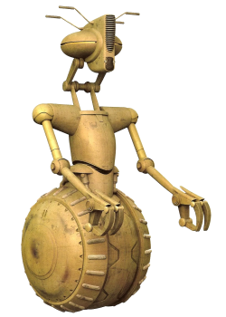

# Droide, Classe V

## Tratti del Droide, Classe V

|<!-- -->|<!-- -->
|---|---
|Aumento dei punteggi caratteristica|Il punteggio di Forza aumenta di 2 e la Destrezza o Costituzione aumentano di 1
|Eta'|I droidi non invecchiano, ma hanno bisogno di manutenzione per continuare a funzionare
|Allineamento|Neutrale
|Taglia|Media
|Velocita'|9m
|Tipo|Il tuo tipo di creatura e' considerato: droide
|Armatura Integrata|Non puoi indossare un'armatura ma puo' essere integrata nel tuo telaio durante un riposo lungo. Questa operazione deve essere effettuata da qualcuno competente negli strumenti astro-tecnologici. Devi essere competente nel tipo di armatura che decidi di installare
|Resistenze dei Droidi|Sei resistente ai danni di tipo: necrotico, veleno e psichico. Sei immune all'avvelenamento ed alle malattie
|Sistemi dei Droidi|Non hai bisogno di mangiare, bere o respirare. Inoltre non hai bisogno di possedere un tecno-focus per lanciare poteri tecnologici
|Vulnerabilita' dei Droidi|Sei vulnerabile ai danni di tipo: ionico. Inoltre subisci svantaggio nei tiri salvezza contro effetti che infliggerebbero danni ionici od elettrici
|Insensibilita' alla Forza|Non puoi utilizzare poteri della forza o prendere livelli in classi che usano il forza-lancio
|Modalita' Mantenimento|Invece di dormire, devi spendere 3 ore eseguendo un sottoprogramma di mantenimento durante un riposo lungo per ottenerne i benefici. Durante questa fase subisci svantaggio delle prove di Saggezza (Percezione). Qualora il riposo lungo venisse interrotto, per completarlo non devi cominciare da capo, ma puoi riprendere da dove si e' interrotto
|Manovale|Sei competente nella abilita' di Atletica e nell'utilizzo di una dotazione da artigiano
|Stazza Prestante|La capacita' di carico, spingere, trascinare o sollevare un peso vengono duplicate. Se sono gia' duplicate, allora triplicale
|Ricostruzione Rapida|Come azione bonus puoi spendere uno o piu' Dadi Vita per recuperare punti ferita
|Linguaggi|Sai parlare, leggere e scrivere: Binario. Comprendi il Galattico Base parlato ed un linguaggio bonus a scelta, ma non sai parlarli
