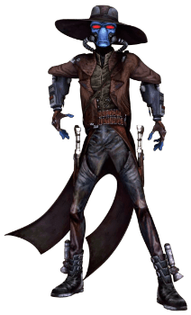

# Duros

## Tratti dei Duros

|<!-- -->|<!-- -->
|---|---
|Aumento dei punteggi caratteristica|Il punteggio di Destrezza aumenta di 2 e l'Intelligenza aumenta di 1
|Eta'|I duros raggiungono la maturita' intorno ai 20 anni e vivono fino a circa 150 anni
|Allineamento|Neutrale
|Taglia|Media
|Velocita'|9m
|Scurovisione|Vedi 18m attraverso luce fioca come se fosse luce intensa e nell'oscurita' come se fosse luce fioca. Nell'oscurita' non vedi i colori, solo gradazioni di grigio
|Viaggiatore Galattico|Sei competente nelle abilita' Pilotare e Storia
|Navigatore|Sei competente nell'utilizzo degli attrezzi da geometra
|Memoria Superiore|Puoi raddoppiare il bonus di competenza quando effettui delle prove di Intelligenza(Storia) per ricordare informazioni delle quali sei venuto a conoscenza o per ricordare i dettagli delle varie esperienze vissute
|Resistenza alla Tecnologia|Ottieni vantaggio nei tiri salvezza su Destrezza ed Intelligenza contro i poteri tecnologici
|Linguaggi|Sai parlare, leggere e scrivere: Galattico Base e Durese
