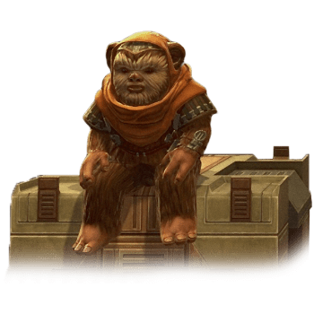

# Ewok

## Tratti degli Ewok

|<!-- -->|<!-- -->
|---|---
|Aumento dei punteggi caratteristica|Il punteggio di Destrezza aumenta di 2 e la Costituzione aumenta di 1
|Eta'|Gli ewok raggiungono la maturita' intorno ai 13 anni e vivono fino a circa 50 anni
|Allineamento|Tendente al lato chiaro della forza
|Taglia|Piccola
|Velocita'|7.5m
|Specialisti di Armi Improvvisate|Puoi spendere 1 ora, anche nel mezzo di un riposo breve, per creare un'arma con materiali trovati nei dintorni. Puoi creare un'arma cinetica semplice ma il danno dell'arma subisce una penalita' di -1
|Olfatto Acuto|Ottieni vantaggio nelle prove di Saggezza(Percezione) che comprendono l'utilizzo dell'olfatto
|Maschera Selvatica|Puoi nascondersi anche se sei parzialmente oscurato da: fogliame, pioggia fitta, nevicate, nebbia ed altri fenomeni naturali simili
|Cultura Musicale|Sei competente nell'utilizzo di uno strumento a scelta
|Survivalista Innato|Sei competente nelle prove di Natura e Sopravvivenza
|Arrampicata in Pianta|Velocita' di Scalare 7.5m. Ottieni vantaggio nei tiri salvezza su Forza e nelle prove di abilita' Forza(Atletica) che coinvolgono lo scalare
|Sottodimensionato|Non puoi utilizzare scudi pesanti, armi da guerra con la proprieta' a due mani a meno che non abbiano anche la proprieta' leggera e se un'arma da guerra ha la proprieta' versatile, puoi impugnarla solo a due mani
|Linguaggi|Sai parlare, leggere e scrivere Ewokese. Sei in grado di comprendere il Galattico Base parlato e scritto ma non sai parlarlo
