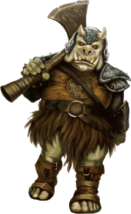

# Gamorrean

## Tratti dei Gamorrean
|||
|---|---
|Aumento dei punteggi caratteristica|Il punteggio di Forza aumenta di 2 e la Costituzione di 1
|Eta'|I gamorrean raggiungono la maturita' intorno ai 13 anni e vivono fino a circa 70 anni
|Allineamento|Caotico neutrale
|Taglia|Media
|Velocita'|9m
|Robustezza Gamorreana|I tuoi punti ferita massimi aumentano di 1 ed aumentano di 1 punto ogni volta che guadagni un livello. Inoltre ottieni vantaggio nei tiri salvezza su Costituzione
|Armi Gamorreane|Sei competente nell'utilizzo delle armi: vibro-ascia, vibro-mazza e vibro-spada
|Attacchi Selvaggi|Se infliggi un danno critico con un'arma corpo a corpo puoi tirare uno dei dadi del danno dell'arma una volta in piu' ed aggiungerlo al danno extra del colpo critico
|Linguaggi|Sai parlare, leggere e scrivere Gamorrese. Sei in grado di comprendere il Galattico Base, ma non sai parlarlo