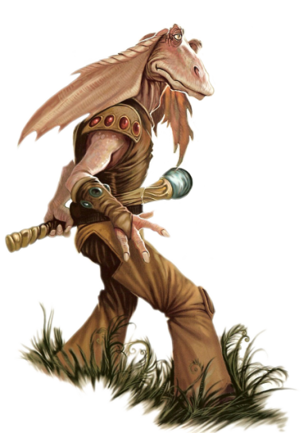

# Gungan

## Tratti dei Gungan

|<!-- -->|<!-- -->
|---|---
|Aumento dei punteggi caratteristica|Il punteggio di Destrezza aumenta di 2 e la Forza aumenta di 1
|Eta'|I gungan raggiungono la maturita' intorno ai 13 anni e vivono fino a circa 70 anni
|Allineamento|Tendente al lato chiaro della forza
|Taglia|Media
|Velocita'|9m
|Anfibio|Puoi respirare sott'acqua
|Scurovisione|Vedi 18m attraverso luce fioca come se fosse luce intensa e nell'oscurita' come se fosse luce fioca. Nell'oscurita' non vedi i colori, solo gradazioni di grigio.
|Flessibile|Ottieni vantaggio nelle prove di Destrezza(Acrobazia) basate sulla flessibilita'
|Sensibilita' al Caldo|Subisci svantaggio nei tiri salvezza su Costituzione contro l'esaurimento causato dal caldo intenso.
|Competenza Marziale|Sei competente nell'utilizzo di armature leggere e medie e nell'utilizzo delle armi: tecno-bastone e vibro-lancia
|Gambe Forti|Quando effettui un salto orizzontale, percorri un numero di metri pari al tuo punteggio di Forza diviso 4 (arrotondato per eccesso al piu' vicino multiplo di 1.5). Quando effettui un salto in verticale il numero di metri del tuo balzo e' 3 + due volte il modificatore di Forza
|Nuotare|Ottieni velocita' di nuotare 9m
|Linguaggi|Sai parlare, leggere e scrivere: Galattico Base e Grungan. Quando parli il Galattico Base trovi difficolta' nel pronunciare alcune parole o coniugare alcuni verbi.
