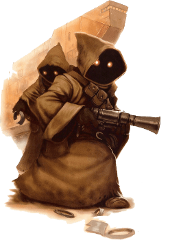

# Jawa

## Tratti dei Jawa
|||
|---|---
|Aumento dei punteggi caratteristica|Il tuo punteggio di Destrezza aumenta di 2 e l'Intelligenza aumenta di 1
|Eta'|I jawa vengono considerati degli adulti quando portano a termina la prima vendita e vivono per meno di un secolo
|Allineamento|Tendente al lato oscuro della forza
|Taglia|Piccola
|Velocita'|7.5m
|Scurovisione|Vedi 18m attraverso luce fioca come se fosse luce intensa e nell'oscurita' come se fosse luce fioca. Nell'oscurita' non vedi i colori, solo gradazioni di grigio
|Strisciare, Rannicchiarsi ed Elemosinare| Con un'azione, nel tuo turno, puoi rannicchiarti pateticamente per distrarre i tuoi nemici. Fino alla fine del tuo prossimo turno i tuoi alleati guadagnano vantaggio nei tiri per colpire contro tutti i nemici che, entro 3m da te, sono in grado di vederti. Puoi utilizzare nuovamente questo tratto una volta completato un riposo breve o lungo
|Acclimazione al Caldo|Ottieni vantaggio nei tiri salvezza su Costituzione contro l'esaurimento causato dal caldo intenso
|Neofita Tecnologico|Conosci il potere tecnologico, a volonta', Esplosione di Ioni (Ion Blast). Raggiunto il livello 3 impari il potere tecnologico Riparare Droide (Repair Droid) che puoi lanciare una volta per riposo lungo. Al livello 5 impari il potere tecnologico Bloccare Droide (Hold Droid) che puoi lanciare una volta per riposo lungo. La caratteristica di tecno-lancio e' Intelligenza. Non hai bisogno di un computerino da polso per lanciare questi poteri
|Furfanteria|Sei competente nell'abilita' Rapidita' di Mano
|Armeggiare|Sei competente nell'utilizzo delle dotazioni da armeggiatore. Puoi spendere 1 ora e materiali dal valore di 100cr per costruire un Dispositivo Minuscolo (CA 5, 1 PF). Puoi utilizzare l'azione di prendere un oggetto per far eseguire al dispositivo una delle seguenti azioni: creare una piccola esplosione, creare un suono assordante continuo per 1 minuto, creare del fumo per 1 minuto, causare un piccolo incendio elettrico. Puoi manutenere un numero di questi dispositivi, contemporaneamente, pari al bonus di competenza. Un dispositivo smette di funzionare se e' lontano da te per piu' di 24h. Puoi smantellare un dispositivo per recuperare i materiali utilizzati per crearlo
|Sottodimensionato|Non puoi utilizzare scudi pesanti, armi da guerra con la proprieta' a due mani a meno che non abbiano anche la proprieta' leggera e se un'arma da guerra ha la proprieta' versatile, puoi impugnarla solo a due mani
|Linguaggi|Sai parlare, leggere e scrivere Jawaese (ed il Linguaggio di Commercio Jawa). Sei in grado di comprendere il Galattico Base scritto e parlato ma non sai parlarlo