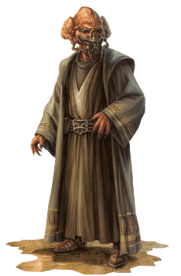

# Kel Dor

## Tratti dei Kel Dor

|<!-- -->|<!-- -->
|---|---
|Aumento dei punteggi caratteristica|Il punteggio di Saggezza aumenta di 2 e la Destrezza di 1
|Eta'|I kel dor raggiungono la maturita' intorno ai 18 anni e vivono per meno di un secolo
|Allineamento|Legale neutrale
|Taglia|Media
|Velocita'|9m
|Scurovisione|Vedi 18m attraverso luce fioca come se fosse luce intensa e nell'oscurita' come se fosse luce fioca. Nell'oscurita' non vedi i colori, solo gradazioni di grigio
|Biologia Aliena|Non puoi respirare ossigeno. Utilizzi un respiratore per negare gli effetti negativi dell'ossigeno. Se ti viene rimosso il respiratore in un ambiente con presenza d'ossigeno perdi conoscenza
|Vita nel Vuoto|Sei resistente ai danni necrotici. Se vieni esposto al vuoto dello spazio sei in grado di sopravvivere un numero di ore pari al tuo modificatore di Costituzione (minimo 1h) anziche' il solito numero di round.
|Telepatia|Sei in grado di comunicare telepaticamente con le creature che si trovano entro 9m da te. Devi condividere un linguaggio con la creatura per poterci comunicare
|Linguaggi|Sai parlare, leggere e scrivere: Galattico Base e Kel Dor
