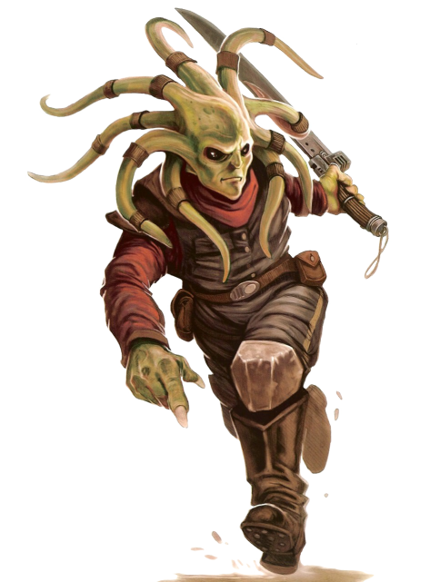

# Nautolan

## Tratti dei Nautolan

|<!-- -->|<!-- -->
|---|---
|Aumento dei punteggi caratteristica|Il punteggio di Destrezza aumenta di 2 e la Saggezza aumenta di 1
|Eta'|I nautolan raggiungono la maturita' intorno ai 13 anni e vivono fino a circa 70 anni
|Allineamento|Tendente al lato chiaro della forza
|Taglia|Media
|Velocita'|9m
|Olfatto Sopraffino|Ogni volta che effettui una prova di Saggezza(Percezione) che comprende l'utilizzo dell'olfatto, va effettuata come so avessi maestria nell'abilita'
|Anfibio|Puoi respirare sott'acqua
|Scurovisione|Vedi 18m attraverso luce fioca come se fosse luce intensa e nell'oscurita' come se fosse luce fioca. Nell'oscurita' non vedi i colori, solo gradazioni di grigio
|Pelle Dura|Quando non indossi alcuna armatura o ne indossi una leggera, la tua CA e' 12 + il modificatore di Destrezza
|Empatia Innata|Ottieni vantaggio nelle prove di Saggezza(Intuizione) effettuate per comprendere le emozioni di umanoidi o bestie che si trovano entro 3m da te
|Nuotare|Ottieni velocita' di nuotare 9m
|Linguaggi|Sai parlare, leggere e scrivere: Galattico Base e Nautila
