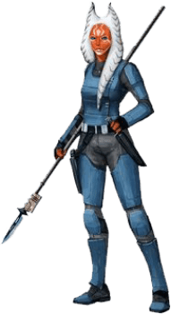

# Togruta

## Tratti dei Togruta

|<!-- -->|<!-- -->
|---|---
|Aumento dei punteggi caratteristica|Il punteggio di Saggezza aumenta di 2 e la Forza o la Destrezza aumentano di 1
|Eta'|I togruta raggiungono la maturita' intorno ai 18 anni e vivono per circa meno di un secolo
|Allineamento|Tendente al lato chiaro della forza
|Taglia|Media
|Velocita'|9m
|Maschera Selvatica|Puoi nascondersi anche se sei parzialmente oscurato da: fogliame, pioggia fitta, nevicate, nebbia ed altri fenomeni naturali simili
|Montral Recettivi|Ottieni percezione tellurica 9m. Sei in grado di identificare precisamente l'origine delle vibrazioni fintanto che tu e la sorgente siate sulla stessa superficie o sostanza. Percezione tellurica non puo' essere utilizzata per identificare creature volanti od incorporee
|Cacciatore Selvatico|Sei competente nell'abilita' di Sopravvivenza
|Linguaggi|Sai parlare, leggere e scrivere: Galattico Base e Togruti
