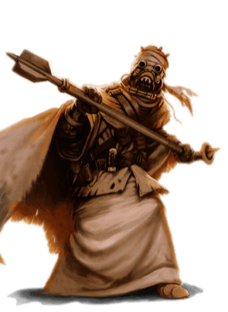

# Tusken

## Tratti dei Tusken
|||
|---|---
|Aumento dei punteggi caratteristica|Il punteggio di Costituzione aumenta di 2 e la Forza od il Carisma aumentano di 1
|Eta'|I tusken sono considerati adulti a 15 anni. Per colpa del clima ostile del loro mondo d'origine raramente vivono per piu' di meta' secolo
|Allineamento|Lato caotico oscuro della forza
|Taglia|Media
|Velocita'|9m
|Aggressivo|Con un'azione bonus puoi muoverti fino al massimo della tua velocita' verso un nemico che sei in grado di vedere o sentire. Se decidi di utilizzare questo tratto devi terminare il turno in uno spazio piu' vicino possibile al nemico di quando hai iniziato il turno
|Addestratore di Animali|Sei competente nell'abilita' di Addestrare Animali
|Ruggito Minaccioso|Una volta al giorno puoi lanciare il potere della forza Paura (Fear). Il carisma e' la caratteristica di forza-lancio.
|Sopravvissuto delle Sabbie|Sei competente nell'abilita' di Sopravvivenza ed il deserto, per te, non risulta come terreno difficile. Infine, ottieni vantaggio nei tiri salvezza su Costituzione contro l'esaurimento causato dal caldo estremo
|Riluttanza Tecnologica|Non puoi utilizzare poteri tecnologici o prendere livelli in classi con tecno-lancio
|Armi Tusken|Sei competente nelle armi: fucile cycler, vibro-ascia
|Linguaggi|Sai parlare Tusken e sai parlare, leggere e scrivere: Galattico Base. Il Tusken non ha una forma scritta. I tusken conoscono un complesso linguaggio dei segni che utilizzano per comunicare tra simili in modo silenzioso