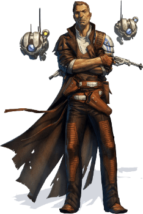

# Umano

## Tratti degli Umani
|||
|---|---
|Aumento dei punteggi caratteristica|Un punteggio abilita' a scelta aumenta di 2 e due altri punteggi a scelta aumentano di 1. Alternativamente, 4 punteggi abilita' aumentano di 1 ciascuno.
|Eta'|Gli umani raggiungono la maturita' intorno ai 18 anni e vivono circa per meno di un secolo
|Allineamento|Neutrale
|Taglia|Media
|Velocita'|9m
|Ostinato|Quando tu o una creatura che puoi vedere e che e' in grado di vederti e capirti effettuate: una prova di abilita', un tiro per colpire od un tiro salvezza, puoi tirare 1d4 ed aggiungerlo al loro tiro (non e' un'azione). Puoi utilizzare nuovamente questo tratto dopo aver terminato un riposo breve o lungo.
|Versatilita' Umana|Sei competente in un'abilita', uno strumento ed un'arma a piacere
|Linguaggi|Sai parlare, leggere e scrivere: Galattico Base ed un linguaggio bonus a piacere.